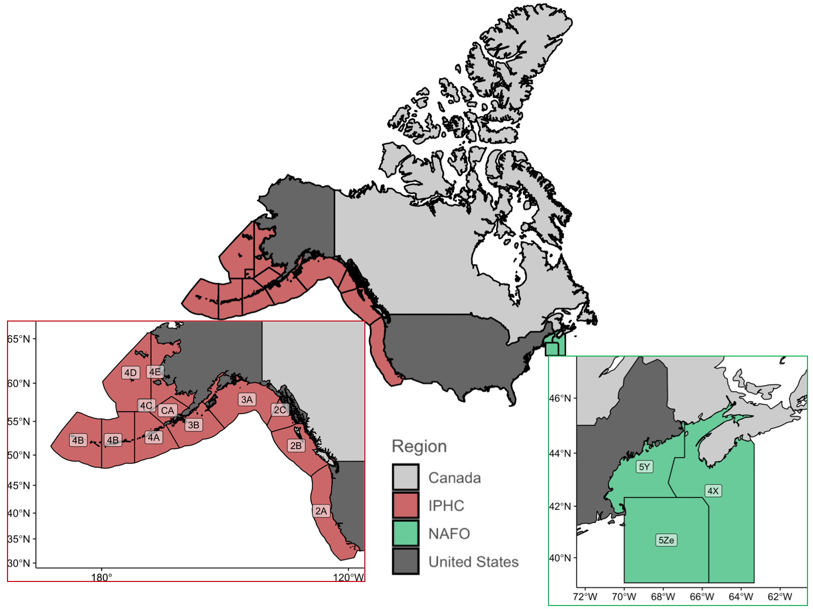
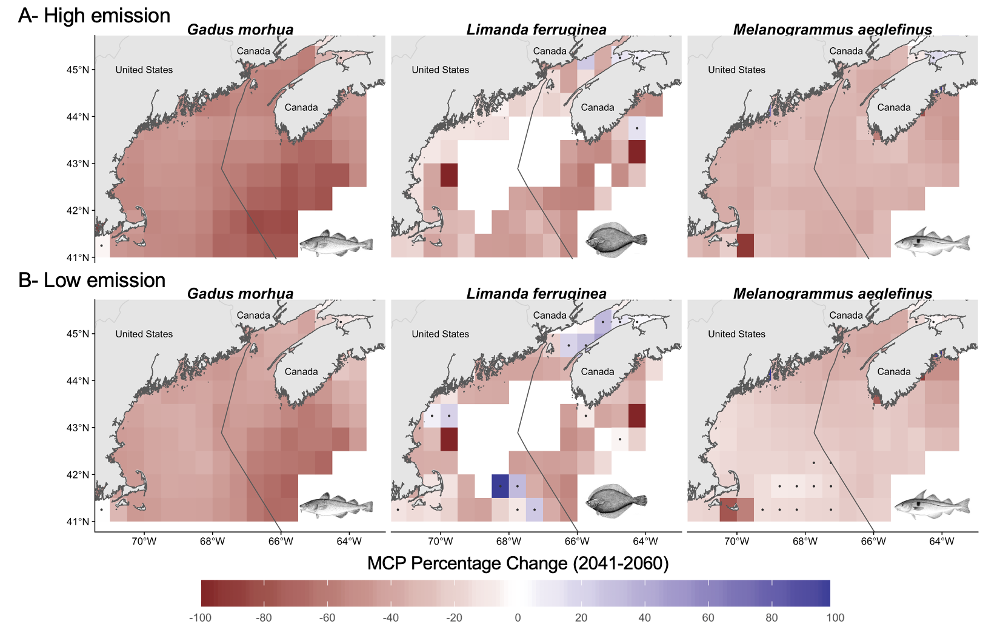
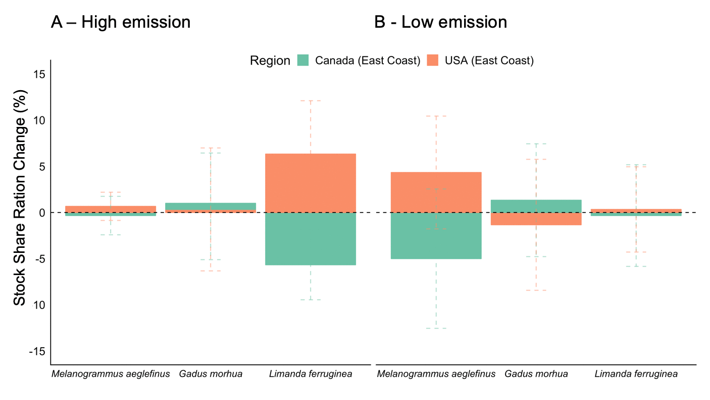

---
output:
  bookdown::pdf_book:
    toc : false
  # pdf_document: default
  # word_document: default
editor_options:
  chunk_output_type: console
csl: ../References/E&S.csl
bibliography: ../References/Oceans_Canada_Biblio.bib
header-includes: #allows you to add in your own Latex packages
- \usepackage{float} #use the 'float' package
- \floatplacement{figure}{H} #make every figure with caption = h
---
 
```{r setup_oc, eval = T, echo = F, warning = F, message = F, results = 'hide'}

#### READ ME !!! ####
# Run this chunk before knit so you make sure you have all pkgs installed in R

library(MyFunctions)

#### Library ####
packages <- c(
 "readxl", # Read dataframe
 "dplyr", # Data manipulation
 "tidyr", # Data manipulation
 "ggplot2", #Nice grpahs and spatial analysis
 "cowplot",
 "rgdal",
 "RColorBrewer",
 "knitr",
 "kableExtra",
 "data.table",
 "ggrepel",
 "gridExtra",
 "ggmap",
 "rgeos",
 "sf",
 "sp",
 "rgdal", #Spatial analysis 
 "tools", #Spatial analysis 
 "png", # For reading plots in chunk codes
 "grid", # For reading plots in chunk codes
 "here"
)

my_lib(packages)

##________________________________________________##

 # Current time
Beg_In <- paste(2005); Beg_In
Beg_End <- paste(2014); Beg_End

# Mid century
Mid_In <- paste(2041);Mid_In # 2046
Mid_End <- paste(2060);Mid_End

# End Century
End_In <- paste(2080);End_In # 2090
End_End <- paste(2099);End_End
```

## Abstract

Climate change is shifting the distribution of fish stocks that straddle between Exclusive Economic Zones (EEZ), challenging transboundary fisheries management. Here, we examine the projected sharing of jointly managed transboundary fish stocks between Canada and the United States. We hypothesize that ocean warming will alter the sharing of fish stocks between the two countries, and that such changes will intensify under a high carbon emission scenario. We look at the specific cases of the International Pacific Halibut Commission that manages Pacific halibut (*Hippoglossus stenolepis*) and a resource sharing arrangement in the Gulf of Maine for cod (*Gadus morhua*), haddock (*Melanogrammus aeglefinus*) and yellowtail flounder (*Limanda ferruginea*) to discuss the management consequences of shifts in transboundary stocks. We rely on multiple Earth system models’ simulations and species distribution models to estimate the change in catch potential and stock share ratio of each transboundary stock in the $21^{st}$ century under two climate change scenarios. Results show that, even under a low emission scenario, most transboundary fish stocks sharing ratios, i.e., the proportion of the total catch of a fish stock taken by a given country, will change by 2050 relative to present. The overall reduction in catch potential, in addition to the changes in stock-share will further exacerbate trade-offs between changes in species catch potential. Such trade-offs in the Atlantic and Pacific regions will be amplified if a high emission scenario is followed, relative to a low carbon emission scenario. Based on the simulation results, we examine possible solution options to reduce climate risks on transboundary fish stocks and fisheries.


Keywords: *Transboundary fisheries management; climate change; joint fisheries management; species distribution shift*

## Introduction

<!-- ##### First paragraph of paper summary -->

In 1982, the United Nations Law of the Sea Convention (UNCLOS) formalized the concept of economic exclusive zones (EEZs) creating what we know today as shared stocks **[@UnitedNations:1986tl]**, i.e. stocks that migrate between countries EEZs (known as transboundary stocks) or between EEZs and the high seas (also called straddling stocks) [@Song:2017iua]. Today, an estimated 347 [@Teh:2015gd] to 1500 [@Caddy:1997ue] fish stocks cross national borders, some of them jointly managed by two or more countries. These stocks are responsible for almost 50% of these countries total fish catches [@Teh:2015gd]. Under Article 63, UNCLOS incentives actions to cooperate on the management of shared stocks [@UnitedNations:1986tl] as often management success depends on effective cooperation between parties [@Munro:2002uf; @Sumaila:2013hv]. Since the definition of shared stocks, game theory has been one of the most common approaches used to analyze the management of these type of stocks. However, shared stocks' management can be convoluted due to the participation of several fishing “players”, different countries and sometimes jurisdictions within a country, the migration patterns of the stock, and their abundance fluctuation within space and time [@Munro:2002uf, Engler and Saunders this Special Feature]. In addition, international treaties might not be prepared to address the effects that climate change will bring to shared fish stocks (Engler and Saunders this Special Feature, Koubrak and VanderZwaag, this Special Feature).

<!-- ##### Climate Change and Transboundary Fisheries -->

The ocean is getting warmer [@Rheim:2013fv], less oxygenated [@Schmidtko:2017cl], and increasing in acidity [@Ross:2011kd; @IPCC:2019to]. To cope with these changes in ocean biophysic properties, marine species, including shared fish stocks, have been shifting their distribution towards the poles and/or deeper waters [@Poloczanska:2016kk]. As climate change reshapes the ocean's environment worldwide [@Gattuso:2015jz], shared fisheries' delicate governance is threatened as new migration patterns may arise [@Miller:2013iv; @Pinsky:2018cb], historic distribution and abundances might shift [@Cheung:2010dt], and species basic natural traits may modify [@Pauly:2017hpa]. Catches of shared stocks like tunas, have significantly increased in some regions such as the subtropical Atlantic and western Pacific Oceans and are projected to continue [@MonllorHurtado:2017cm; @ErauskinExtramiana:2019fw]. Multiple shared species in North America have been observed to shift in distribution following changes in optimal conditions such as sockeye salmon (*Oncorhynchus nerka*) [@McDaniels:2010vn], Atlantic cod [@Pershing:2015gq], and flounders [@Pinsky:2012kq]. Moreover, these shifts are projected to continue towards the end of the $21^{st}$ century [@Cheung:2018hz]. As a result, some countries or management jurisdictions may see more shared fisheries and their catches shifting into their waters while others will stand to lose [@Oremus:2020id; @Pinsky:2018cb]. Nevertheless, management rules for shared stocks (e.g. quota or spatial delimitation) are often determined based on current and/or historic knowledge of the stock's distribution and do not consider future shifts in distributions [@FredstonHermann:2018kp]. 

<!-- ##### Past Conflicts of shifting stocks -->

The shifts in distribution of shared fish stocks will impact the economics of their fisheries [@Pinsky:2012kq; @Sumaila:2019gh, Sumaila et al., this Special Feature], and create international disputes between countries [@Munro:2002uf; @Spijkers:2017ij; @Pinsky:2018cb]. Canada and the US share important transboundary stocks of salmon (*Oncorhynchus spp.*), Pacific halibut (*Hippoglossus stenolepis*), and Atlantic cod (*Gadus morhua*) offering a unique lens to understand the extent to which climate-induced distributional shifts will challenge the future sustainability of transboundary fisheries. These countries have a long history of fisheries cooperation participating in diverse, jointly managed, commercial transboundary stocks through various fisheries management organizations [@NOAA:2018tu]. Furthermore, climate-related fluctuations in stocks' distribution have historically created disputes between Canada and the US, increasing international conflict and threatening the health of diverse transboundary stocks [@Munro:2002uf; @CIA:2017uta].

It is expected that climate induced shifts in stocks’ distribution will affect the rules in place that keep international treaties alive. Therefore, the main objective of this article is to assess the level of exposure that bi-lateral transboundary fisheries treaties between Canada and the US have to climate change through shifts in stock distributions. Specifically, we rely on a species distribution model and scenario planning to project the changes in the distribution of selected fish stocks jointly managed by Canada and the United States focusing on two case studies (the International Pacific Halibut Commission and a fisheries arrangement for the Gulf of Maine) Finally, we explore similar situations around the world and identify opportunities to improve the adaptability of transboundary stocks management to climate change in North America. Despite an overall expectation of species following a poleward shift, important geographic constraints (e.g. Gulf of Alaska representing a latitudinal block) [@Kleisner:2016je], geo-political features (e.g. the localization of Alaska in reference to Canada and the contiguous states), and management rules (e.g. quota allocations, spatial management rules) may play an important role in the redistribution of benefits. Understanding these stocks shifts will shed a light on future conditions and inform decision-makers on the paths to follow under a changing climate.

## Methods

### Study Area and Fisheries

The current study used the International Pacific Halibut Commission (IPHC) and the Gulf of Maine arrangement (hereafter referred as GoMA) as case studies to discuss the implications that climate change could have in the management of transboundary stocks. For the IPHC, we used the most updated spatial regulatory data along its 12 regulatory areas [@IPHCSecreatriat:2017uz; @IPHC:2019wt]. For this specific case, we considered Alaska as a separate entity, the US contiguous states as a second one (Washington, Oregon and California), and lastly British Columbia (Canada). For the GoMA we used the Northwest Atlantic Fisheries Organization's (NAFO) divisions 5Y, 5Ze, and 4X[^NAFO] within latitudes 46.2°N and 41.5°S, and longitudes -72°W and -64°E (Fig. 1). Is worth mention that, while NAFO's divisional zones were used in this study for domestic management, NAFO does not manage fisheries within the EEZs of Canada and the United States. Fisheries data fpr the projections was gathered from the Sea Around Us from 1951 to 2014 [@Zeller2016].

[^NAFO]: Northwest Atlantic Fisheries Organization, Available at https://www.nafo.int/Science/

```{r Study_Area_Map, eval = F, echo = F, warning=F, message=F}

Countries <- c("Canada","United States")

### North America Initial Map ####
path_world <- my_path("G",Extra_Path = "Spatial/TM_WORLD_BORDERS-0.3")
file_name <- "TM_WORLD_BORDERS"

World_Land_sf <- st_read(dsn = path_world, 
layer = file_path_sans_ext(file_name)
) %>% 
st_transform(crs = 3832)

# names(World_Land_sf)

North_America_Land <- World_Land_sf %>% 
filter(NAME %in% Countries) %>% 
st_transform(crs = 3832)

# head(North_America)

# ggplot(North_America_Land) +
#  geom_sf() +
#  coord_sf(ylim = c(3051701,11528813)
#  )


### North America EEZs Map ####
path_eez <- my_path("G",Extra_Path = "Spatial/World_EEZ_v10_2018-0.3")
#The File
fnam_eez <- "eez_v10.shp"

eez_world_sf <- st_read(dsn = path_eez, 
            layer = file_path_sans_ext(fnam_eez)
) %>% 
 st_transform(crs = 3832)

Nort_America_EEZ <- eez_world_sf %>% 
filter(Territory1 %in% Countries)

# Testing
ggplot(Nort_America_EEZ) +
geom_sf()

# Testing together

ggplot(North_America_Land) +
 geom_sf() +
 geom_sf(data = Nort_America_EEZ, colour = "black") +
 coord_sf(ylim = c(3051701,11528813)
 )

#### IPHC Regulatory Areas ####

path_IPHC <- my_path("D",Extra_Path = "IPHC/IPHC_RegulatoryAreas/")

# The Canada file
fnam_IPHC_C <- "IPHC_RegulatoryAreas_CAN"


IPHC_Reg_C <- st_read(dsn = path_IPHC, 
           layer = file_path_sans_ext(fnam_IPHC_C)
) %>% 
 select(
  ID,
  Country = COUNTRY,
  State = PROV_EN,
  RegArea
 ) %>% 
 mutate(Comments = "NA") %>% 
 st_transform(crs = 3832)

# 4326 use this to merge with DBEM data
# 3832 use this to center the map and plot

# ggplot(IPHC_Reg_C) +
# geom_sf()
 

# The US File
fnam_IPHC_US <- "IPHC_RegulatoryAreas_US"

IPHC_Reg_US <- st_read(dsn = path_IPHC,
            layer = file_path_sans_ext(fnam_IPHC_US)
) %>%
 st_transform(crs = 3832)

# head(IPHC_Reg_US)
ggplot(IPHC_Reg_US) +
 geom_sf()

### Combine both shapefiles

IPHC_Reg <- rbind(IPHC_Reg_US,IPHC_Reg_C)

ggplot(IPHC_Reg) +
 geom_sf()

##### NAFO Regulatory Area ####

path_NAFO <- paste(Data_path,"Spatial/NAFO")
#The File
fnam_NAFO <- "Divisions"

NAFO_Area <- st_read(dsn = path_NAFO,
           layer =file_path_sans_ext(fnam_NAFO))%>% 
 st_transform(crs = 3832) 

Zones <- c(
 "5Ze",
 # "5Zw",
 "5Y",
 "4X"
)

NAFO_5z <- NAFO_Area %>% 
filter(ZONE %in% Zones)

# head(NAFO_5z)

ggplot() +
geom_sf(data = North_America_Land,
    fill = "lightgrey",
    colour = "black") +
 my_ggtheme_m()()
 

#### The final Map ####

# Homonize collors 
brewer.pal(name="Set2",5)

# Canada "#grey80"
# US "#grey40", 
# NAFO "#66CC99"
# IPHC #f01282

#North America point of view

North_A <- ggplot() +
 geom_sf(data = North_America_Land, 
     aes(fill = NAME),
     colour = "black"
 ) +
 geom_sf(data = IPHC_Reg, 
     aes(fill = "IPHC") ,
     colour = "black"
 ) +
 geom_sf(data = NAFO_5z, 
     aes(fill = "NAFO"),
     colour = "black"
 ) +
 my_ggtheme_m()() +
 scale_fill_manual("Region",
          breaks = c("Canada","IPHC","NAFO", "United States"), 
          values=c("grey80","#CC6666","#66CC99","grey40")
          ) +
 theme(legend.position = "right")

ggsave("Fig1_NA.png",
    plot = North_A,
    width = 6,
    height = 5,
    units = "in",
    path = Results_Path)

#NAFO #

NAFO <- ggplot() +
 geom_sf(data = NAFO_5z, #NAFO regions
     aes(fill = "NAFO"),
     colour = "black"
 )+
 geom_sf_label(data = NAFO_5z, # RegAreas labels
        aes(
         label = ZONE#,
         # fill = "NAFO"
        ),
        alpha = 0.5
 ) +
 geom_sf(data = North_America_Land, # North America Land
     aes(fill=NAME),
     colour = "black"
 ) +
 coord_sf(ylim = c(5951701,4728813),
      xlim = c(15373019,16573019)
 ) +
 # scale_fill_brewer("Region",palette = "Set2") +
 theme(
  panel.background = element_blank(),
  panel.border   = element_blank(),
  panel.grid.minor = element_blank(),
  panel.grid.major = element_line(color = "transparent"),
  legend.position = "bottom",
  axis.title = element_blank()
 ) +
 scale_fill_manual("Region",breaks = c("Canada", "NAFO", "United States"), 
          # values = c("#E78AC3","#A6D854","8DA0CB")
          values=c("grey80", "#66CC99", "grey40")
          ); NAFO


# Save plot for manuscrip
ggsave("Fig1_NAFO.png",
    plot = NAFO,
    width = 6,
    height = 5,
    units = "in",
    path = my_path("R"))


# IPHC

IPHC_Reg$RegArea <- gsub("Closed Area","CA",IPHC_Reg$RegArea)

IPHC <- ggplot() +
 geom_sf(data = IPHC_Reg,
     aes(fill = "IPHC"),
     colour = "black"
 ) + 
 geom_sf(data = North_America_Land, # North America Land
     aes(fill=NAME),
     colour = "black"
 ) +
 geom_sf_label(data = IPHC_Reg, # RegAreas labels
        aes(
         label = RegArea#,
         # fill = Percentage
        ),
        alpha = 0.5
 ) +
 
 coord_sf(xlim = c(1963800, 10041910), # Subsets north america
      ylim = c(3651701,9728813)
 ) +
 theme(
  panel.background = element_blank(),
  panel.border   = element_blank(),
  panel.grid.minor = element_blank(),
  panel.grid.major = element_line(color = "transparent"),
  legend.position = "bottom",
  axis.title = element_blank()
 ) +
 scale_fill_manual("Region",breaks = c("Canada", "IPHC", "United States"), 
          values=c("grey80", "#CC6666", "grey40")
          )

# Save plot for manuscrip
ggsave("Fig1_IPHC.png",
    plot = IPHC,
    width = 6,
    height = 5,
    units = "in",
    path = my_path("R"))

```
<!--  -->

```{r Figure1-map, eval = F, echo=FALSE, fig.height = 4, fig.width = 6, fig.cap="Map of Canada and the US with the regulatory areas of the International Pacific Halibut Commission and the NAFO sub-divisions containing the Gulf of Maine arrangement"}

img <- readPNG("./Figures/Figure 1.png")
grid.raster(img)

```
<insert Figure 1>

```{r Spatial_data, eval = F, echo = F, warning=F, message=F, results = 'hide'}

# List of DBEM INDEX within the EEZ
#Data provided by Vicki Lam
EEZIDs_List <- my_path("G",Extra_Path = "Spatial/DBEM",Name="Updated_EEZList_17June2016.xlsx",Read = TRUE)

EEZ_CellID <- my_path("G",Extra_Path = "Spatial/DBEM",Name="EEZ_CellID.xlsx",Read = TRUE)
colnames(EEZ_CellID) <- c("EEZID","INDEX")

# DBEM Coordinate system
Coor <- my_path("G",Extra_Path = "Spatial/DBEM", Name = "Lon_Lat_DBEM.txt", Read = TRUE)
colnames(Coor) <- c("INDEX","Longitude","Latitude")

### Select EEZs
EEZs <- c(
 "Canada (Pacific)",
 "Canada (Arctic)",
 "USA (West Coast)",
 "USA (Alaska, Arctic)",
 "USA (Alaska, Subarctic)",
 "Canada (Arctic)",
 "Canada (East Coast)",
 "USA (East Coast)"
)

### North America Initial Map ####

path_world <- my_path("D",Extra_Path = "Spatial/TM_WORLD_BORDERS")
file_name <- "TM_WORLD_BORDERS"

World_Land_sf <- st_read(dsn = path_world, 
             layer = file_path_sans_ext(file_name)
) %>% 
 st_transform(crs = 4326)

# names(World_Land_sf)

North_America_Land <- World_Land_sf %>% 
 filter(NAME %in% c("Canada","United States")) %>% 
 st_transform(crs = 3832) # 4326 use this to merge with DBEM data
# 3832 use this to center the map and plot

#### _____________________TEST _____________________ #
# head(North_America_Land)
# ggplot(North_America_Land) +
#  geom_sf() +
#  coord_sf(xlim = c(-120, -179),
#      ylim = c(30,70)
#  )
##__________________________________________ #

### North America EEZs Map ####

path_eez <- my_path("D",Extra_Path = "Spatial/World_EEZ_v10_2018")
#The File
fnam_eez <- "eez_v10.shp"

eez_world_sf <- st_read(dsn = path_eez, 
            layer = file_path_sans_ext(fnam_eez)
) %>% 
 st_transform(crs = 4326)# 4326 use this to merge with DBEM data
# 3832 use this to center the map and plot


#### _____________________TEST _____________________ #
# head(eez_world_sf)
### Test this map
# ggplot(ezz_North_America) +
#  geom_sf()
##__________________________________________##


#### IPHC Regulatory areas ####

## Correct DBEM for Alaska ####
IHPC_EEZs <- c(
 "Canada (Pacific)",
 # "Canada (Arctic)"
 "USA (West Coast)",
 "USA (Alaska, Arctic)",
 "USA (Alaska, Subarctic)"#,
 # "Russia (Far East)"
)

IPHC_EEZsID <- EEZIDs_List %>% 
 filter(Name %in%IHPC_EEZs) %>% 
 left_join(EEZ_CellID,
      by = "EEZID") %>% 
 left_join(Coor,
      by = "INDEX")

# "Move" the map so results are not in the other side of the world and it matches the projection I want
IPHC_Coor_Corrected <- IPHC_EEZsID %>% 
 filter(Longitude > 0) %>% 
 mutate(Longitude = Longitude-360)

IPHC_Coor_Corrected <- IPHC_EEZsID %>% 
 filter(Longitude < 0) %>% 
 bind_rows(IPHC_Coor_Corrected) %>% 
 filter(Latitude > 25) 

# Create new column to merge with shapefiles

IPHC_Coor_Corrected_Clean <- IPHC_Coor_Corrected %>% 
 mutate(
  State = ifelse(Name == "Canada (Pacific)", "British Columbia",
          ifelse(Name == "USA (West Coast)","WAORCA","Alaska"))
 ) %>% 
 select(
  # State,
  INDEX,
  longitude = Longitude,
  latitude = Latitude)


# Now we load IPHC shapefiles ####
path_IPHC <- my_path("D",Extra_Path = "Spatial/IPHC_RegulatoryAreas")
# The Canada file
fnam_IPHC_C <- "IPHC_RegulatoryAreas_CAN"


IPHC_Reg_C <- st_read(dsn = path_IPHC, 
           layer = file_path_sans_ext(fnam_IPHC_C)
) %>% 
 select(
  ID,
  Country = COUNTRY,
  State = PROV_EN,
  RegArea
 ) %>% 
 mutate(Comments = "NA") %>% 
 st_transform(crs = 4326)

# 4326 use this to merge with DBEM data
# 3832 use this to center the map and plot

#### _____________________TEST _____________________##
# head(IPHC_Reg_C)
# ggplot(IPHC_Reg_C) +
# geom_sf()
##_________________________________________________##
# The US File
fnam_IPHC_US <- "IPHC_RegulatoryAreas_US"

IPHC_Reg_US <- st_read(dsn = path_IPHC, 
            layer = file_path_sans_ext(fnam_IPHC_US)
) %>% 
 st_transform(crs = 4326) 

#### _____________________TEST _____________________ #
# head(IPHC_Reg_US)
# ggplot(IPHC_Reg_US) +
#  geom_sf()
##_________________________________________________##

### Combine both shapefiles

IPHC_Reg <- rbind(IPHC_Reg_US,IPHC_Reg_C)

#### _____________________TEST _____________________ #
# head(IPHC_Reg,12)
# tail(IPHC_Reg)
# unique(IPHC_Reg$State)

# It's going to take a while... 
# ggplot(IPHC_Reg) +
#  geom_sf()
##_________________________________________________##


# Now join the Shapefile with the DBEM lat/long dataset

# Convert DBEM to sf
IPHC_Coor_sf = st_as_sf(IPHC_Coor_Corrected_Clean,
            coords = c("longitude", "latitude")) %>% 
 st_set_crs(4326) %>% # to match shapefiles
 st_transform(4326) # to match shapefiles

# head(IPHC_Coor_sf)

# Merge DBEM sf to polygons
IPHC_Reg_DBEM <- st_join(IPHC_Reg,
             IPHC_Coor_sf, join = st_contains) %>% 
 filter(!is.na(INDEX)) %>%
 arrange(INDEX) 
# %>% 
#  st_transform(3832) # Go back to original projection otherwise doesnt like to plot

IPHC_Reg_DBEM_df <- as.data.frame(IPHC_Reg_DBEM) %>% 
 select(INDEX,RegArea)

#### _____________________TEST _____________________ #
# head(IPHC_Reg_DBEM_df)
# IPHC_Reg_DBEM_df %>% 
#  arrange(INDEX) %>% 
# head()
##_________________________________________________##


### STOP 
## Go to the results and now estimate the %change by region using IPHC_Reg_DBEM_df then, convert it to sf and merge it with IPHC_Reg


# Gulf of Maine ####
#### NAFO data ####


# path_NAFO <- paste(Data_Path,"/Spatial/NAFO",sep="")
#The File
# fnam_NAFO <- "Divisions"

# NAFO_Area <- st_read(dsn = path_NAFO,
# layer =file_path_sans_ext(fnam_NAFO))


Zones <- c(
 "5Ze",
 # "5Zw",
 "5Y",
 "4X"
)

# NAFO_5z <- NAFO_Area %>% 
# filter(ZONE %in% Zones)

#### _____________________TEST _____________________ #
# head(NAFO_5z)

# ggplot(NAFO_5z) +
# geom_sf()
# geom_sf(aes (fill = ZONE))
##_________________________________________________##


### Atlantic EEZ polygon (I don't think we need this for now) ####

Atlantic_EEZs <- c(
 "Canada (Arctic)",
 "Canada (East Coast)",
 "USA (East Coast)"
)
 
Atlantic_EEZsID <- EEZIDs_List %>%
 filter(Name %in% Atlantic_EEZs) %>%
 left_join(EEZ_CellID,
      by = "EEZID") %>%
 left_join(Coor,
      by = "INDEX")

### Atlantic DBEM Data ####

GB_Coor <- Coor %>% 
 filter(INDEX %in% Atlantic_EEZsID$INDEX) %>% 
 mutate(one = 1) 

# Atlantic Land polygon ####

Countries <- c(
 "Canada",
 "United States"
)

### EEZ GM ####
eez_GM <- eez_world_sf %>% 
 filter(Territory1 %in% Countries)

#### _____________________TEST _____________________ #
# ggplot() +
#  geom_sf(data = eez_GM) +
#  coord_sf(xlim = c(-71.0592, -63.33333),
#      ylim = c(40.5,45.9759)
#      )
##_________________________________________________##

GM_Land <- World_Land_sf %>% 
 filter(NAME %in% Countries)

```

### The International Pacific Halibut Commission

The IPHC was established by Canada and the United States to oversee the management of Pacific halibut (*Hippoglossus stenolepis*) [@IPHC:2014tz]. There are 12 regulatory areas from which 3AB holds 51.2% of the stock, followed by regions 2ABC and 4ACDE with 23.1% and 20.4%, respectively, and lastly region 4B with only 5.2% of the stock distribution [@IPHC:2018vz]. In terms of management, the IPHC implements a total allowable catch (TAC) based on a yearly sampling of the Convention area in addition to a series of regulations to control fishing effort [@IPHC:2018vz]. The TAC is divided between recreational, subsistence and commercial fishery, with a portion set aside for bycatch of other fisheries [@IPHC:2019wt]. The commercial fishing season starts in March ending around November with restrictions allowing only set line gear with J-type hooks targeting individuals over 81.3 cm of total length [@IPHC:2019wt].

<insert Table 1>

### The Gulf of Maine Arrangement

Since 1998 Canada and the US have used a "Resource Sharing Understanding" to inform the management of Eastern George Bank's Atlantic cod (*Gadus morhua*) and haddock (*Melanogrammus aeglefinus*) and, yellowtail flounder (*Limanda ferruginea*) [@Pudden:2007bo; @TRAC:2016wu; @Song:2017va]. From 2010 onward, the GoMA suggests catch-limits based on a weighted method where 10% represents the stocks’ historical distribution (from 1967 to 1994) and 90% current distributions produced by quarterly surveys and catch [@TRAC:2016wu]. Since its introduction, the average quota allocation for each species proposed by the GoMA has been; Atlantic cod 77% Canada and 23% US, haddock 55% Canada and 45% US, and yellowtail flounder 34% Canada and 66% US [Table 1, @TRAC:2015wj; @TRAC:2015vp; @TRAC:2015tt; @TRAC:2018tw; @TRAC:2018tj; @TRAC:2018wx; @Trinko:2019ou]. However, because this is an unofficial agreement, Canada and the US ultimately take single management decisions [@Soboil:2006gw]. In terms of management, the US has a multi species harvest control with area and season closures, mesh sizes, effort control, and mobile gear vessels that use bottom otter trawl gear [@Soboil:2006gw]. In contrast, Canada has a quota system in addition to limited-entry licensing, fleet allocations, and mesh and fish size regulation, among other input controls. Canada inshore vessels fish cod with longline and gillnet while haddock is mainly caught with bottom otter trawl gear [@Soboil:2006gw].

<insert Table 2>


### Projecting Future Species Distribution

We used a Dynamic Bioclimatic Envelope Model (DBEM) to project the distribution of species from 2015 to 2100 under two scenarios of climate change [@Cheung:2010dt; @Cheung:2016jd]. The DBEM algorithm integrated ecophysiology and habitat suitability with spatial population dynamics of exploited fishes and invertebrates to project shifts in abundance and potential fisheries catches under climate change. The algorithm predicted species distribution based on depth and latitudinal range, habitat preferences and an index of species association with major habitat types to estimate changes in abundance distribution over a **0.5º x 0.5º** grid of the world ocean. For each grid cell and time step, the model then calculated species carrying capacity according to sea surface temperature, salinity, oxygen content, sea ice extent (for polar species) and bathymetry, as well as the species preferences to these conditions. It then incorporated the intrinsic population growth, settled larvae, and net migration of adults from surrounding cells using an advection-diffusion-reaction equation. Finally, the model also simulated the effects of changes in temperature and oxygen content on growth of individuals [@Cheung:2013gk; @Cheung:2016jd]. Ultimately, the model simulated spatial and temporal population dynamics, and estimated a proxy of maximum sustainable yield (MSY) by applying fishing at MSY level for each grid cell, hereafter referred as maximum catch potential (MCP).

We projected the DBEM using three Earth system models (ESM), the Geophysical Fluid Dynamics Laboratory Earth System Models 2M (GFDL)[^GFDL], the Institute Pierre Simon Laplace Climate Model 5 (IPSL-CM5)[^IPSL], and the Max Planck Institute for Meteorology Earth System Model (MPI)[^MPI]. Each model was downscaled to match the DBEM **$0.5^{\circ}$ x $0.5^{\circ}$** grid using the nearest neighbor method, and in some cases, bilinear interpolation [@Cheung:2016hf]. Finally, we used the model outputs for two scenarios of the Intergovernmental Panel on Climate Change (IPCC)-Representative Concentration Pathways (RCP) 2.6 and 8.5 representing a low greenhouse gas emission (strong mitigation) and a high greenhouse gas emission (week mitigation) scenario, respectively [@IPCC:2014bz]. To estimate model robustness and capture the structural uncertainty build within ESM models, we averaged the DBEM results for all three models **(<mu> +- <sigma>)** and marked regions where at least one ESM disagree in direction with the rest.

[^GFDL]: Geophysical Fluid Dynamics Laboratory Earth System Models 2M [online] https://www.gfdl.noaa.gov
[^IPSL]:Institute Pierre Simon Laplace Climate Model 5 [online] https://www.icmc.ipsl.fr
[^MPI]: Max Planck Institute for Meteorology Earth System Model [online] https://www.mpimet.mpg.de/en/science/models

```{r Data_Loading_For_DBEM, eval = F, echo = F, warning = F ,message = F}

# Species data (Names, treaties, etc)
# DBEM exploited species list (ONLY ON DROBO)
exploited_species_list <- fread("/Volumes/DATA/PROJECTION exploited species ENM/exploited_species_list.csv")

# IPHC and GB species
Selected_Species <- fread(paste(Data_Path,"Species/List_Species.csv",sep=""))

# NAFO Species
# This is the subset of species Fished on canada and US waters of all NAFO's species list
NAFO_Species <- read.csv(paste(Data_Path,"Species/NAFO_Species.csv",sep="")) %>%
 mutate(Treaty = "NAFO")

```

```{r DBEM_Data_For_All, eval = F, echo = F, warning = F, message = F}

#-------------------- NOTE --------------------#
# Chunk to be ran in Hall100 connected to DROBO
#---------------------------------------------#

All_Species <- exploited_species_list %>% 
 # filter(TaxonName %in% c("Hippoglossus stenolepis","Anoplopoma fimbria")) %>% 
 filter(TaxonName %in% NAFO_Species$TaxonName) %>%
 mutate(Treaty = "NAFO") %>% 
 bind_rows(Selected_Species) %>% 
 filter(! duplicated(TaxonName)) %>% # Removes duplicated
 select(TaxonName,
     TaxonKey,
     CommonName,
     Treaty)


# For suplement Material ####
# Suplemental_table <- All_Species %>% 
#  select(-TaxonKey) %>% 
#  mutate(Treaty = ifelse(TaxonName %in% NAFO_Species$TaxonName,"NAFO",
#             ifelse(TaxonName %in% c("Hippoglossus stenolepis",
#                         "Anoplopoma fimbria"),
#                 "IPHC",
#                 "PSC")
#             )
#  ) %>% 
#  rename("Scientific name" = TaxonName,
#     "Common name" = CommonName) 
# 
#  write.csv(Suplemental_table,
#       "Final_Species_List.csv",
#       row.names = F)

#_____________________________END SUPLEMENTAL TABLE_______________________________#

Models <- c(
 "GFDL26F1",
 "GFDL85F1",
 "IPSL26F1",
 "IPSL85F1",
 "MPI26F1",
 "MPI85F1"
)


for(m in 1:length(Models)){
 # for(s in 1:2){ #For tensting models
 for(s in 1:nrow(All_Species)){
  
  # Imports all data once# 
  
  x <-dbem_Import(All_Species[s,2],# Include Treaties information
          2005,
          2099,
          Model = Models[m],
          Data_Type= "Catch"
  )
  
  
  # } # For testing the dbem_Import function
  
  
  ### If statement for abstent species ##
  
  if(length(x >= 1)){
   
   # Merging with lat/long ###
   Spp_Pro <- x %>% 
    left_join(Coor,
         by = "INDEX")
   
   # If statement for those species not found within national EEZ
   if(nrow(Spp_Pro) <= 1){
    
    print("No data within Area Selected")
    
   }else{
    
    # Include Species Name
    Spp_Pro$Species <- paste(All_Species[s,1])
    # Include Treaties information
    Spp_Pro$Treaty <- paste(All_Species[s,4])
    
    Spp_Pro_I <- as.data.table(Spp_Pro)
    
    # Groups all species together in one database
    if(s == 1){
     Data_P <- copy(Spp_Pro_I) # <- copies the previouse data.table
    }else{
     setkey(Data_P, # <- sets the data.table as "reference" ?setkey
         Species); setkey(Spp_Pro_I,
                 Species);
     list <- list(Data_P, # <- creates a list to merge the tables
            Spp_Pro_I)
     
     Data_P <- rbindlist(list, #<- Merges all the data in one single file.
               use.names = TRUE, # <- This will merge columns by Name
               fill = TRUE, # <- This allows for the NA's
               idcol = NULL) # Columns id
    }
   }
  } #if statement for species outside EEZ
 } # Species loop end
 
 #Include wich model the data is from
 Data_P$Model <- paste(Models[m])
 
 # Groups all models together in one database
 if(m == 1){
  DBEM_Results <- copy(Data_P) # <- copies the previouse data.table
 }else{
  setkey(DBEM_Results, # <- sets the data.table as "reference" ?setkey
      Species); setkey(Data_P,
              Species);
  list <- list(DBEM_Results, # <- creates a list to merge the tables
         Data_P)
  
  DBEM_Results <- rbindlist(list, #<- Merges all the data in one single file.
               use.names = TRUE, # <- This will merge columns by Name
               fill = TRUE, # <- This allows for the NA's
               idcol = NULL) # Columns id
 }
 
} #End of loops


#### _____________________TEST _____________________ #
# names(DBEM_Results)
# unique(DBEM_Results$Model)
# unique(DBEM_Results$Species)
# unique(DBEM_Results$Treaty)
# length(unique(DBEM_Results$Species))
# head(DBEM_Results)

# Check that each species has 6 per INDEX or less (GFDL x2 + IPSL x2 + MPIS x2)

# DBEM_Results %>%
#  group_by(Species,INDEX) %>%
#  summarise(n()) %>%
#  View()

# DBEM_Results %>% 
#  filter(Species == "Alosa pseudoharengus",
#     INDEX == 52809)

# Checked! 

# Test that NAFO species are actually NAFO species

# DBEM_Results %>% 
#  filter(Treaty == "NAFO") %>% 
#  group_by(Species) %>% 
#  summarise(n())

# Checked!

### Check for potential repeated cells

# DBEM_Results <- Raw_DBEM_Results %>% 
#  select(INDEX,Species,Model,everything())
# 
# DBEM_Results_Clean <- DBEM_Results[!duplicated(DBEM_Results[1:3]), ]

# Checked!

### Russia distribution check ###
# In the Far East sea... 
# 
# Russia <- EEZIDs_List %>% 
#  filter(Name == "Russia (Far East)") 
# 
# Russia_EEZsID <- EEZIDs_List %>% 
#  filter(Name %in% Russia$Name) %>% 
#  left_join(EEZ_CellID,
#       by = "EEZID")
# 
# names(Russia_EEZsID)[3] <- "INDEX"
# 
# unique(Russia_EEZsID$Name)
# 
# Salmones <- c("Oncorhynchus tshawytscha",
#        "Oncorhynchus keta",
#        "Oncorhynchus kisutch",
#        "Oncorhynchus gorbuscha"
#        )
# 
# DBEM_Results %>% 
#  filter(INDEX %in% Russia_EEZsID$INDEX) %>%
#  filter(Longitude > 0 ) %>% 
#  group_by(INDEX, Longitude, Latitude) %>%
#  summarise(n =n()) %>%
#  ggplot(.,
#     aes(x = Longitude,
#       y = Latitude,
#       fill = n
#     ),
#     size = 0.05,
#     alpha = 0.5) +
#  geom_tile() + 
#  coord_map(projection = "mercator")

# Looks fine... Just like when you past it the other way... 


#### _____________________END TEST _____________________ #

### Save the dataset
# write.csv(DBEM_Results,
#      "Raw_Data.csv",
#      row.names = FALSE)
     
```

### Estimation of Maximum Catch Potential Change

For estimating the percentage change of MCP at the regional scale, we first aggregated the yearly mean MCP of all species per region ($X_{yr}$) and period: 

$$ X_{yr} = \sum_{s = 1}^n \hat{MCP_s}$$
<!-- <eqn1> -->

where *y* is year, *r* is region, *s* is species, *n* is total number of species, and $\hat{MCP}$ is the MCP averaged by the three ESMs. In the case of the GoMA, region was defined as the **$0.5^{\circ}$ x $0.5^{\circ}$** grid-cell within the specific NAFO divisional zones. For the IPHC analysis, region was defined as the Commission's regulatory areas (Fig. 1). We then averaged the values in three time periods (*t*) to reduce temporal model sensitivity. Thus, we computed the regional percentage change in MCP **(<DELTA>MCPr)** as follows:

$$\Delta MCP_r = -(1-\frac{X_{t}}{X_{t_0}})*100 $$
<!-- <eqn2> -->

Where $X_{t}$ is the future average MCP for each of the two time periods analyzed in this study and $t_0$ is the present averaged MCP (<mu> `r Beg_In`-`r Beg_End`). Note that in cases where $X_{0}$ = 0 and $X_{t}$ > 0, then **(<DELTA>MCPr)** = 100%, consequently, the opposite case would give a -100% result. This way, Equ. 2 shows the percentage change in MCP by mid $21^{st}$ century when $X_t$ = <mu> `r Mid_In`-`r Mid_End`, and end of $21^{st}$ century when $X_t$ = <mu> `r End_In`-`r End_End`, relative to today ($t_0$). The rationale between choosing these time periods was to provide a relative short-term projection (mid-century) that would be more policy-relevant but also show the long-term trend (end of century).

<!-- #### Estimation of Changes in Catch Proportion -->

In addition, we borrowed the concept of “threat point” from game theory defined as the minimum payoff that a player is willing to receive in order to cooperate with other players (see Sumaila et al., this Special Feature). Thus, we estimated the change in the <DELTA>MCP (threat point) that each country (players) would have for each species (hereafter referred as stock-share ratio), for both the IPHC and the GoMA. The stock-share ratio can be seen as the proportion of the stock’s distribution within the study area that each country has. For this, we first modified Equ. 1, to estimate the aggregated yearly mean MCP of each species per region. We then averaged the results by the same previously motioned periods (present, mid and end of the **21st** century). Next, for each species we estimated the stock-share ratio **(<alpha> s)** that each region had during each time period:

$$\alpha_{s} = \frac{\theta_{rt}}{\delta_{rt}}$$

Where **<theta>rt** is the species' aggregated $\hat{MCP}$ of each region at time period *t*, and **<delta>rt** is the species' aggregated $\hat{MCP}$ of the whole specie's distribution within the study area at the same time period. Finally, we estimated the percentage change in stock-share ratio substituting $X_{t_0}$ and $X_{t}$ by **<alpha>t0** and **<alpha>t**, respectively in Equ. 2. The process was carried out for each ESM and results presented as average **+-** standard deviation (sd). All of the analysis was done in the statistical software *R* version 3.5.2 (2018-12-20) with the associated packages, *data.table* [@Packagedatatable:2019uh], *ggrepel* [@PackageggrepelAut:2018to], *gridExtra* [@PackagegridExtraM:2017wx], *knirt* [@PackageknitrAGen:2020wt], *RColorBrewer* [@PackagerColorBrewer:2014uw], *sf* [@PackagesfSimpleF:2018vp], and *tidyverse* [@PackagetidyverseE:2017vq]. All code is available at http://www.github.com/jepa/OC_Transboundary.

<!-- Finally, we estimated the ($\alpha$) percentage change ($\Delta\alpha$) for each region as follows: -->
<!-- $$\Delta\alpha = -(-1-\frac{\alpha_{f}}{\alpha_{p}})*100 $$ -->
<!-- where $\alpha_{f}$ is the future MCP proportion of each region (mid 21^st^ century and end of the 21^st^ century). -->

## Results

```{r Load_Data, echo = F, eval = F, results='hide', warning=F,message=F}

# List of DBEM INDEX within the EEZ
#Data provided by Vicki Lam
EEZIDs_List <- read_excel(paste(my_path("G",Extra_Path = "Spatial/DBEM"),"Updated_EEZList_17June2016.xlsx",sep=""))

EEZ_CellID <- read_excel(paste(my_path("G",Extra_Path = "Spatial/DBEM"),"EEZ_CellID.xlsx",sep=""))
colnames(EEZ_CellID) <- c("EEZID","INDEX")

# DBEM Coordinate system
Coor <- my_path("G",Extra_Path = "Spatial/DBEM", Name = "Lon_Lat_DBEM.txt", Read = TRUE)
colnames(Coor) <- c("INDEX","Longitude","Latitude")

# Raw DBEM results
Raw_DBEM_Results <- my_path("D",Extra_Path = "Ecol/Distribution", Name = "Raw_Data.csv", Read = TRUE)

%>% 
 filter(Species != "Anoplopoma fimbria") #Remove

### Number of stocks per treaty##
Raw_DBEM_Results %>%
 group_by(Treaty) %>%
 summarise(x= length(unique(Species)))

#### North American EEZs ####

EEZs <- c(
 "Canada (Pacific)",
 "USA (West Coast)",
 "USA (Alaska, Arctic)",
 "USA (Alaska, Subarctic)",
 "Canada (Arctic)",
 "Canada (East Coast)",
 "USA (East Coast)"
)

All_EEZs <- EEZIDs_List %>% 
 filter(Name %in% EEZs) %>% 
 left_join(EEZ_CellID,
      by = "EEZID")

names(All_EEZs)[3] <- "INDEX"


# LAT LONG Corrections for Alaska

DBEM_Corrected <- Raw_DBEM_Results %>% 
 filter(INDEX %in% All_EEZs$INDEX) %>% 
 filter(Longitude > 0) %>% 
 mutate(Longitude = Longitude - 360)

DBEM_Corrected <- Raw_DBEM_Results %>% 
 filter(INDEX %in% All_EEZs$INDEX) %>% 
 filter(Longitude < 0) %>% 
 bind_rows(DBEM_Corrected)


#### __________________TEST NA Map _____________________ #

# DBEM_Corrected %>%
#  group_by(INDEX, Longitude, Latitude) %>%
#  summarise(n =n()) %>%
#  ggplot(.,
#     aes(x = Longitude,
#       y = Latitude,
#       fill = n
#     ),
#     size = 0.05,
#     alpha = 0.5) +
#  geom_tile() #+
# coord_map(projection = "mercator")

#### __________________All good_____________________________ #

### Get ridd of Pacific Species in the Atlantic

NAFO_E <- DBEM_Corrected %>% 
 filter(Longitude >= -100)

Pacific <- DBEM_Corrected %>% 
 filter(Treaty != "NAFO")

DBEM_Corrected <- NAFO_E %>% 
 bind_rows(Pacific)

# Species on dataset
# unique(DBEM_Corrected$Species)

# Number of species on dataset
# length(unique(DBEM_Corrected$Species))

### Get ridd of Atlantic Species in the Pacific

Pacific_Spp <- DBEM_Corrected %>% 
 filter(Longitude <= -100)

Atlantic <- DBEM_Corrected %>% 
 filter(Treaty == "NAFO")

DBEM_Corrected <- Pacific_Spp %>% 
 bind_rows(Atlantic)

###______ Double chack species distributions are correct ###

# DBEM_Corrected %>%
#  ggplot(.,
#     aes(
#      x = Longitude,
#      y = Latitude,
#      fill = log(INDEX)
#     )
#     ) +
#  geom_tile() +
#  facet_wrap(~Treaty+Species)

#### __________________All good_____________________________ #


### Final step for shapefile no need for knitting

DBEM_Coor <- DBEM_Corrected %>%
 group_by(INDEX,Longitude,Latitude) %>%
 summarise(n=n()) %>%
 select(-n,
     longitude =Longitude,
     latitude = Latitude)


## Create shapefile for merging with analysis and IPHC shapefile

DBEM_Coor_sf = st_as_sf(DBEM_Coor,
             coords = c("longitude", "latitude")) %>%
 st_set_crs(4326) %>% # to match shapefiles
 st_transform(4326) # to match shapefiles

#### _____________________TEST _____________________ #
# head(DBEM_Coor_sf)
# 
# ggplot(DBEM_Coor_sf) +
#  geom_sf() +
#  geom_sf(data=North_America_Land)
# 
#### _______________________________________________ #

```

### Projected change to species managed by the IPHC

At least one third of the IPHC regulatory areas will see a reduction in MCP of Pacific halibut by 2050 relative to current MCP, regardless of the climate change scenario (Fig. 2). It is likely that the stock shift from the US. contiguous states towards Canada will offset the shift of the later towards northern regions, resulting in undetectable changes in Canadian area 2B and Alaskan 2C under both climate change scenarios. The potential movement of halibut westward will increase the MCP of regulatory areas 3B (under a low emission scenario) and 4ABCE along the Aleutian Islands and Bering Sea. Regions 4DE, the most poleward regulatory areas of the IPHC, are expected to gain MCP by mid (Fig. 2) and end of the $21^{st}$ century (Fig. A1.1) under a high emission scenario due to the expansion of halibut suitable habitat as sea ice retreats (Fig. A2.1). In contrast, under a low emission scenario, sea ice is expected to stabilize towards mid 21st century, thus providing less “new” suitable habitat for Pacific halibut and resulting in undetectable changes in MCP for the region (Fig. 2B) and decreasing even more towards 2100 (Fig. A1.1).

```{r IPHC_Map_Result_Regions, eval = F, echo = F}

Selected_Species <- c("Hippoglossus stenolepis") # Halibut

# Path for saving plots
Path <- my_path("R",Extra_Path = "IPHC")
RCP = c("GFDL26F1","IPSL26F1","MPI26F1") #Low RCP
#### New version

# ------------------ #
# Estimate IPHC change 
# ------------------ #

IPHC_MCP_Change <- DBEM_Corrected %>% 
  filter(Species %in% Selected_Species) %>% 
  left_join(IPHC_Reg_DBEM_df,
            by = "INDEX") %>% 
  filter(!is.na(RegArea)) %>% 
  mutate(RCP = ifelse(Model %in% RCP,"Low_Emission","High_Emission")) %>% 
  gather("Year","MCP",Beg_In:End_End) %>% 
  # Indicate the three period times
  mutate( 
    Period = ifelse(Year >= Beg_In & Year <= Beg_End,"Beginning",
                    ifelse(Year >= Mid_In & Year <= Mid_End,"Mid_Century",
                           ifelse(Year >= End_In & Year <= End_End,"The_End_Century",
                                  "Other_Years"))
    )
  ) %>% 
  # Sum of Index per Region
  group_by(RegArea,Model,RCP,Year,Period) %>% 
  summarise(Regional_MCP =sum(MCP,na.rm=T)) %>% 
  # Average pero Time period
  group_by(RegArea,Model,RCP,Period) %>% 
  summarise(Mean_T_MCP =mean(Regional_MCP,na.rm=T)) %>%
  filter(Period != "Other_Years") %>% 
  spread(Period,Mean_T_MCP) %>% 
  # Divide future values by present
  mutate_at(vars(Mid_Century,
                 The_End_Century),
            funs(ifelse(Begining > 0, ./Begining,.)) #if no species today value is the future
  ) %>% 
  # Estimate percentage change
  mutate_at(vars(Mid_Century, 
                 The_End_Century),
            funs(ifelse(Begining == 0 & . == 0, 0, # If for no change than 0
                        ifelse(Begining == 0 & . > 0, 100, # If changes from 0 to anything then 100
                               round(-(1-.)*100) # Estimate percentage change
                        )
            )
            )
  ) %>% 
  gather("Period","MCP_Change",Mid_Century,The_End_Century) %>% 
  mutate(Direction = ifelse(MCP_Change >= 0, "Positive","Negative")) %>% 
  # Average results per ESMs
  group_by(RegArea,Period,RCP) %>% 
  summarise_at(vars(MCP_Change),
               funs("Mean_ESM_MCP_Chng"=mean,
                    "sd_ESM_MCP_Chng"=sd,
                    "N_ESMs"=n(),
                    "Model_Agreement_Index" = paste(length(unique(Direction)),collapse = ";"),
                    "Model_Agreement_Direction" = paste(Direction,collapse = ";")
               )
  ) %>%
  mutate(
    Model_Agreement = ifelse(Model_Agreement_Index == 1, "","*"),
    Model_Agreement_sd = ifelse(abs(Mean_ESM_MCP_Chng) < sd_ESM_MCP_Chng*2,"No","Yes")
  ) %>% 
  ungroup() %>% 
  # set everything over 100 to 100
  mutate_at(vars(Mean_ESM_MCP_Chng,
                 sd_ESM_MCP_Chng),
            funs(ifelse(. > 100, 100,.)
            ) 
  )


# ------------------ #
# Plot and save figure
# ------------------ #

# Spatial Step for regional analysis

IPHC_DBEM_sf <- IPHC_Reg %>% 
 left_join(IPHC_MCP_Change,
      by = "RegArea") %>% 
 st_transform(3832)

# head(IPHC_DBEM_sf)

# Change name so it fits the plot
IPHC_DBEM_sf$RegArea <- gsub("Closed Area","CA",IPHC_DBEM_sf$RegArea)

# Data to plot

# ------- NOTE ------ # 
# Change for main figure and S3 figure
# ---------------------- #

IPHC_DBEM_sf <- IPHC_DBEM_sf %>% 
 # filter(Period == "Mid_Century") %>% # Paper figure
 filter(Period == "The_End_Century") %>%# Supplemental figure
 mutate(RegArea = paste(RegArea,Model_Agreement,sep=""))

# North America shapefile
North_America_Land <- North_America_Land %>% 
 st_transform(crs = 3832)

# Limit Axis
Seq <- seq(-50,50,by=5) 

# Plot it!
P1 <- ggplot() +
  geom_sf(data = North_America_Land, colour = "lightgrey") + # Land Map of North America
  geom_sf(data = subset(IPHC_DBEM_sf, Country == "United States"), # DBEM Of the US
          aes(fill = Mean_ESM_MCP_Chng)
  ) +
  geom_sf(data = subset(IPHC_DBEM_sf, RegArea == "2B*"), # DBEM of Canada
          aes(fill = Mean_ESM_MCP_Chng)
  ) +
  geom_sf_label(data = IPHC_DBEM_sf, # RegAreas labels
                aes(
                  label = RegArea,
                  fill = Mean_ESM_MCP_Chng
                ),
                colour = "black"
  ) +
  geom_label(data=IPHC_DBEM_sf, aes(label = RCP, x =4080637 , y = 4551701, colour = RCP), #RCP labels for grid plot
             show.legend = FALSE,
             size = 10
  ) +
  facet_wrap(~RCP, # For grid plot, comment in one plot each
             ncol = 2) +
  # scale_colour_manual(values=c("blue", "red")) + #Labels colors for grid plot
  scale_fill_gradient2("",
                       limits=c(-50,50),
                       breaks = Seq) +
  my_ggtheme_m()() +
  theme(
    legend.key = element_rect(size = 4),
    legend.key.width =unit(8,"line"),
    legend.text = element_text(size = 16),
    strip.text.x = element_blank()
  ) +
  coord_sf(xlim = c(1963800, 10041910), # Subsets North America map
           ylim = c(3651701,9728813)
  ) +
  annotate("text", label = "Alaska", x = 6280637, y = 9228813, size = 6, colour = "black") +
  annotate("text", label = "Canada", x = 9629910, y = 9228813, size = 6, colour = "black") +
  annotate("text", label = "US Contiguous\n States", x =10000000, y = 5151701, size = 6, colour = "black", angle = -90)

# Save plot 
# Name = paste("New_IPHC_Reg_26_85_2050.png")
Name = paste("New_IPHC_Reg_26_85_2100.png")

ggsave(Name,
    plot = P1,
    width = 15,
    height = 10,
    units = "in",
    path = Path)

```


```{r Figure_3, eval =F, echo = F}
img <- readPNG(paste(my_path("F"),"Figure 3.png",sep=""))
grid.raster(img)

```

<!-- If rendered to word use , otherwise use chunk -->


The same poleward trend is expected in the change of Pacific halibut stock-share ratio with the average proportion increasing up to 25% in some northern regions and decreasing by 10% in southern regions, relative to the present proportion (Fig. 3). Maintaining emissions to lower levels through 2050 would potentially leave unchanged the stock-share ratio of three regulatory areas (3AC, and 4D) and negatively change regulatory area 2A. On the other hand, failing to achieve such target will decrease the stock-share ratio in the most productive regulatory areas (2AC, 3AB).

```{r IPHC_Proportion_Regions, eval = F, echo = F, message=F, warning=F}

# Set saving path
Path <- my_path("R",Extra_Path = "IPHC/Proportion")
IPHC_Species <- c("Hippoglossus stenolepis") # Halibut

#### FIlter EEZs ###

EEZs <- c(
 "Canada (Pacific)",
 "USA (West Coast)",
 "USA (Alaska, Arctic)",
 "USA (Alaska, Subarctic)"
)

RCP <- c("GFDL26F1","IPSL26F1","MPI26F1")

EEZsID <- EEZIDs_List %>% 
 filter(Name %in%EEZs) %>% 
 left_join(EEZ_CellID,
      by = "EEZID")

names(EEZsID)[3] <- "INDEX"


# ------------------------- #
# Changes in proportion 
# referent to (2005-2014)
# ------------------------- #

# Estimate IPHC total values

IPHC_Absolutes <- DBEM_Corrected %>%
  mutate(RCP = ifelse(Model %in% c("GFDL26F1","IPSL26F1","MPI26F1"),"Low Emission","High Emission")) %>% # Assigns RCP by model
  filter(Species %in% IPHC_Species,
         INDEX %in% IPHC_Reg_DBEM_df$INDEX) %>% #Selects only IPHC species within regulatory areas
  left_join(IPHC_Reg_DBEM_df,
            by = "INDEX") %>% # Include Regulatory areas
  gather("Year","MCP",`2005`:`2099`) %>% 
  group_by(RCP,RegArea,Year,Model) %>%
  summarise(MCP = sum(MCP, na.rm = T))

# Estimate total MCP of each RCP per year
Proportion_Total <- IPHC_Absolutes %>% 
  group_by(RCP,Year,Model) %>% 
  summarise(Total = sum(MCP))

# Estimates the proportion of each RegArea catch pero RCP and Year
Proportion_Data <- IPHC_Absolutes %>% 
  left_join(Proportion_Total,
            by = c("RCP","Year","Model")) %>% 
  mutate(Proportion = (MCP/Total)*100)

# Proportion change in the future (NOTE: not plotting by timeframe because of boxplot)
Proportion_Change <- Proportion_Data %>% 
  mutate(Time_Step = ifelse(Year <= Beg_End, "Beginning_Prop",
                            ifelse(Year >= Mid_In & Year <= Mid_End,"Mid_Century_Prop",
                                   ifelse(Year >= End_In,"The_End_Century_Prop","Others")
                            )
  ),
  Nation = ifelse(RegArea == "2A","US Contiguous",
                  ifelse(RegArea == "2B","Canada","Alaska")
  )
  ) %>% 
  # Get mean proportion by timeframe
  group_by(RCP,
           RegArea,
           Model,
           Time_Step) %>% 
  summarise(Mean_Temp_Prop = mean(Proportion)) %>% 
  spread(Time_Step,Mean_Temp_Prop) %>% 
  # Divide future values by present
  mutate_at(vars(Mid_Century_Prop, 
                 The_End_Century_Prop),
            funs(ifelse(Begining_Prop > 0, ./Begining_Prop,.)) #if no species today value is the future
  ) %>% 
  # Estimate percentage change
  mutate_at(vars(Mid_Century_Prop, 
                 The_End_Century_Prop),
            funs(ifelse(Begining_Prop == 0 & . == 0, 0, # If for no change than 0
                        ifelse(Begining_Prop == 0 & . > 0, 100, # If changes from 0 to anything then 100
                               round(-(1-.)*100) # Estimate percentage change
                        )
            )
            )
  ) %>%
  gather("Time_Step","Prop_Change",Mid_Century_Prop,The_End_Century_Prop) %>% 
  # Average results per ESMs
  group_by(RegArea,Time_Step,RCP) %>% 
  summarise_at(vars(Prop_Change),
               funs("Mean_ESM_MCP_Chng"=mean,
                    "sd_ESM_MCP_Chng"=sd,
                    "N_ESMs"=n()
               )
  ) %>% 
  mutate(Order = as.character(RegArea),
         Nation = ifelse(RegArea == "2A","US Contiguous",
                         ifelse(RegArea == "2B","Canada","Alaska")
         )
  )

Proportion_Change$RegArea <- gsub("2B","2B",Proportion_Change$RegArea) 


# Plot and save figure
ggplot(data = subset(Proportion_Change, Time_Step == "Mid_Century_Prop"),
       aes(
         x = reorder(RegArea,Order), # from forcasts` package
         y = Mean_ESM_MCP_Chng,
         fill = Nation,
         colour = Nation
       )
) +
  geom_bar(stat = "identity") +
  geom_errorbar(data = subset(Proportion_Change, Time_Step == "Mid_Century_Prop"),
                aes(
                  x = reorder(RegArea,Order),
                  ymin=Mean_ESM_MCP_Chng-sd_ESM_MCP_Chng, # mean +- sd
                  ymax=Mean_ESM_MCP_Chng+sd_ESM_MCP_Chng,
                  colour=Nation,
                ),
                width=.2,
                linetype = 2,
                size = 0.6,
                alpha = 0.5
  ) +
  coord_flip() +
  ylab("") +
  geom_hline(yintercept = 0, linetype = "dashed") +
  my_ggtheme_p()() +
  scale_fill_brewer("Region",palette = "Set2") +
  scale_colour_brewer("Region",palette = "Set2") +
  scale_y_continuous(breaks = seq(-40,40,20),
                     limits = c(-40,40)
  )+
  facet_wrap(~RCP,
             nrow = 1) +
  labs(
    x = "",
    y = "Stock Share Ratio Change (%)"
  ) +
  ggsave("Proportion_gom_Mid.png",
         plot = .,
         width = 8,
         height =8,
         units = "in",
         path = Path
  )

```

```{r Figure_4, eval = F, echo = F}

Fig4 <- readPNG(paste(my_path("F"),"Figure 4.png",sep=""))
grid.raster(Fig4)

```

<!-- If rendered to word use , otherwise use chunk -->



### Projected change to species managed under the Gulf of Maine arrangement

While some regulatory areas of the IPHC will see an incremental increase in Pacific halibut MCP, the results for the Gulf of Maine show an overall decrease in MCP by 2050, regardless of the climate change scenario or ESM (Fig. 4), intensifying by the end of the $21^{st}$ century (Fig. A1.2). For cod and haddock, MCP will decrease within the whole Gulf with no apparent win for any country in reference to the current period (Fig. 4). For yellowtail flounder, despite an overall reduction, some discrete areas are expected to increase with no particular pattern and high uncertainty, as ESMs in these regions do not agree in the direction of change (Fig. A2.3). Despite the overall reduction in MCP for all three species in comparison to current values, there is a benefit of achieving a low emission scenario as reductions intensify under the high emission scenario.

```{r GB_Results_Spp, eval = F, echo = F, fig.width=12}

#### Filter Species ####
Atlantic_Species <- c(
  "Gadus morhua", # Cod
  "Limanda ferruginea", # Yellowtail flounder
  "Melanogrammus aeglefinus" # Haddock
)

# Run Spatial chuck for the Atlantic
# NAFO_5z$geometry

# Filter DBEM results for three specific species within the region of the GoM
N_Lim <- 45.9759
S_Lim <- 41
W_Lim <- -72.0592
E_Lim <- -63.33333 

# Limit the area to GoM species
Atlantic_DBEM <- Raw_DBEM_Results %>% 
  filter(Species %in% Atlantic_Species) %>% 
  filter( 
    Latitude < N_Lim, # North
    Latitude > S_Lim, # South 
    Longitude > W_Lim, # West
    Longitude < E_Lim
  )

# Path for saving plots
Path <- my_path("R",Extra_Path = "GoM")

# -------------------- #
### MCP Change Analysis
# -------------------- #

Mean_Data_GoM <- Atlantic_DBEM %>% 
  mutate(RCP = ifelse(Model %in% c("GFDL26F1","IPSL26F1","MPI26F1"),"Low Emission","High Emission")) %>%
  tidyr::gather("Year","Change",`2005`:`2099`) %>%
  mutate(Change = replace_na(Change, 0)) %>% # Convert NA's into 0's
  # Indicate the three period times
  mutate(
    Period = ifelse(Year >= Beg_In & Year <= Beg_End,"Beginning",
                    ifelse(Year >= Mid_In & Year <= Mid_End,"Mid_Century",
                           ifelse(Year >= End_In & Year <= End_End,"The_End_Century",
                                  "Other_Years"))
    )
  ) %>% 
  filter(Period != "Other_Years") %>% # Remove unwanted years
  # Temporal mean
  group_by(INDEX,Model,RCP,Period,Species) %>%
  summarise(
    Mean_Temp = mean(Change, na.rm = T) 
  ) %>% 
  spread(Period,Mean_Temp) %>%
  # Divide future values by present
  mutate_at(vars(Mid_Century, 
                 The_End_Century),
            funs(ifelse(Begining > 0, ./Begining,.)) # if no species today value is the future
  ) %>% 
  # Estimate percentage change
  mutate_at(vars(Mid_Century, 
                 The_End_Century),
            funs(ifelse(Begining == 0 & . == 0, 0, # If for no change than 0
                        ifelse(Begining == 0 & . > 0, 100, # If changes from 0 to anything then 100
                               round(-(1-.)*100) # Estimate percentage change
                        )
            )
            )
  ) %>% 
  gather("Period","MCP_Chng",Mid_Century,The_End_Century) %>% 
  mutate(Direction = ifelse(MCP_Chng >= 0, "Positive","Negative")) %>% 
  %>% # Average results per ESMs
  group_by(INDEX,Species,Period,RCP) 
summarise_at(vars(MCP_Chng),
             funs("Mean_ESM_MCP_Chng"=mean,
                  "sd_ESM_MCP_Chng"=sd,
                  "N_ESMs"=n(),
                  "Model_Agreement" = paste(length(unique(Direction)),collapse = ";")
             )
) %>%
  mutate(
    Model_Agreement = ifelse(Model_Agreement == 1, "Agree","Disagree")
  ) %>% 
  # set everything over 100 to 100
  mutate_at(vars(Mean_ESM_MCP_Chng,
                 sd_ESM_MCP_Chng),
            funs(ifelse(. > 100, 100,.)
            ) 
  ) %>% 
  left_join(GB_Coor,
            by ="INDEX")

 
 # Set Bins for better plotting
 Mean_Data_GoM$Bins <- cut(Mean_Data_GoM$Mean_ESM_MCP_Chng,breaks = 4)
 # unique(New_Mean_Data_GoM$Bins)

# -------------------- #
# Plotting results
# -------------------- #
Seq <- seq(-100,100,10)

Lim_Neg <- min(Seq)
Lim_Max <- max(Seq)

# Use bins and collors yellow orange light red and dark red

# Mean_Data_GoM <- Mean_Data_GoM %>% # In case you want filter a specific species
#  filter(Species == "Limanda ferruginea",
#     Mean_ESM_MCP_Chng >= 0)

pgm <- ggplot(Mean_Data_GoM) +
  geom_tile(data = subset(Mean_Data_GoM, Period == "Mid_Century"),
            aes(
              x = Longitude,
              y = Latitude,
              color = Mean_ESM_MCP_Chng,
              fill = Mean_ESM_MCP_Chng
            )
  ) +
  geom_point(data = subset(Mean_Data_GoM, Period == "Mid_Century" & Model_Agreement == "Disagree"),
             aes(
               x = Longitude,
               y = Latitude
             ),
             size = 1,
             # alpha = 0.3,
             shape = 16,
             color = "grey20"
  ) +
  scale_fill_gradient2(paste("MCP Percentage Change \n",Mid_In,"-",Mid_End,")"), # If not using the bins
                       limits=c(Lim_Neg,
                                Lim_Max),
                       breaks = Seq,
                       na.value = 'darkred' # NA values are present when the species is no more 
  ) +
  scale_colour_gradient2(paste("MCP Percentage Change \n",Mid_In,"-",Mid_End,")"),
                         limits=c(Lim_Neg,
                                  Lim_Max),
                         breaks = Seq,
                         na.value = 'darkred' # NA values are present when the species is no more
  ) +
  geom_sf(data = GM_Land, colour = "lightgrey") +
  geom_sf(data = eez_GM, fill = NA) +
  coord_sf(xlim = c(-71.0592, -63.33333),
           ylim = c(41,45.5)
  ) +
  annotate("text", label = "United States", x = -70, y = 45, size = 4, colour = "black") +
  annotate("text", label = "Canada", x = -66.8, y = 45.4, size = 4, colour = "black") +
  annotate("text", label = "Canada", x = -65.4, y = 44.2, size = 4, colour = "black") +
  my_ggtheme_m()() +
  theme(
    axis.line = element_line(colour = "black", size = .5),
    axis.ticks = element_line(size = .5),
    axis.text.x = element_text(size = 12,
                               angle = 0,
                               face = "plain"),
    axis.text.y = element_text(size = 12),
    legend.key = element_rect(size = 3),
    legend.key.width =unit(8,"line"),
    legend.title = element_text(size = 20),
    legend.text = element_text(size = 18)
  ) +
  facet_wrap(~RCP + Species, 
             ncol = 3
  )

# Name and save
Name = paste("Change_GB_26_85_Mid.png",sep="_")

ggsave(Name,
    plot = pgm,
    width = 20,
    height = 10,
    units = "in",
    path = Path)
 
```


Despite the expected decrease in MCP for the region, changes in the stock-share ratio of species within the Gulf of Maine show different outcomes dependent on the climate change scenario and species in question. Following a high emission path will affect mostly Canada’s share of yellowtail flounder and in less degree haddock, with an increase of cod share. under the low emission scenario, haddock and cod patterns intensify, while yellowtail flounder’s share approaches almost no change (Fig. 5). Such pattern is likely the combination of the bathymetry or the Gulf, the warming gradient, and the species distribution (see discussion).

```{r GB_Proportion_Species, eval = F, echo = F}

### Analysis by Species ####
Path <- my_path("R", Extra_Path = "GoM")

# names(DBEM_Results)

Atlantic_Species <- c(
  "Gadus morhua", # Cod
  "Limanda ferruginea", # Yellowtail flounder
  "Melanogrammus aeglefinus" # haddock 
)


N_Lim <- 45.9759
S_Lim <- 41
W_Lim <- -72.0592
E_Lim <- -63.33333 

# Run Spatial chuck for the Atlantic

Atlantic_DBEM <- Raw_DBEM_Results %>% 
  filter(Species %in% Atlantic_Species) %>% 
  filter( # Limit the area to George's bank
    Latitude < N_Lim, # North
    Latitude > S_Lim, # South 
    Longitude > W_Lim, # West
    Longitude < E_Lim
  )

EEZs <- c(
  "Canada (East Coast)",
  "USA (East Coast)"
)

RCP = c("GFDL26F1","IPSL26F1","MPI26F1")

EEZsID <- EEZIDs_List %>% 
  filter(Name %in%EEZs) %>% 
  left_join(EEZ_CellID,
            by = "EEZID")

names(EEZsID)[3] <- "INDEX"

GB_Coor <- Coor %>% 
  filter(INDEX %in% EEZsID$INDEX) %>% 
  # mutate(one = 1) %>% 
  filter( # Limit the area to George's bank
    Latitude < N_Lim, # North
    Latitude > S_Lim, # South 
    Longitude > -71, # West
    Longitude < E_Lim
  )

# ---------------------------- #
# Estimate GoM proportion change 
# ---------------------------- #

GoM_Absolutes <- Atlantic_DBEM %>% 
  mutate(RCP = ifelse(Model %in% c("GFDL26F1","IPSL26F1","MPI26F1"),"Low Emission","High Emission")) %>% # Assigns RCP by model
  filter(Species %in% Atlantic_Species,
         INDEX %in% GB_Coor$INDEX) %>% #Selects only GoM species within regulatory areas
  left_join(EEZsID,
            by = "INDEX") %>% 
  gather("Year","MCP",`2005`:`2099`) %>% 
  group_by(Species,RCP,Name,Year,Model) %>%
  summarise(MCP = sum(MCP, na.rm = T))

# Estimate total MCP of each RCP per year
Proportion_Total <- GoM_Absolutes %>% 
 group_by(Species,RCP,Year,Model) %>% 
 summarise(Total = sum(MCP))

# Estimates Proportion cahnge in each region and species
Proportion_Change_GoM <- GoM_Absolutes %>% 
  left_join(Proportion_Total,
            by = c("RCP","Year","Model","Species")) %>% 
  mutate(Proportion = (MCP/Total)*100) %>% 
  mutate(Time_Step = ifelse(Year <= Beg_End, "Beginning_Prop",
                            ifelse(Year >= Mid_In & Year <= Mid_End,"Mid_Century_Prop",
                                   ifelse(Year >= End_In,"The_End_Century_Prop","Others")
                            )
  )
  ) %>% 
  # Temporal mean
  group_by(Species, RCP, Name, Model, Time_Step) %>% 
  summarise(Mean_Temp_Prop = mean(Proportion)) %>% 
  spread(Time_Step,Mean_Temp_Prop) %>% 
  mutate_at(vars(Mid_Century_Prop, # Divide future values by present
                 The_End_Century_Prop),
            funs(ifelse(Begining_Prop > 0, ./Begining_Prop,.)) #if no species today value is the future
  ) %>% 
  # Estimate percentage change
  mutate_at(vars(Mid_Century_Prop, 
                 The_End_Century_Prop),
            funs(ifelse(Begining_Prop == 0 & . == 0, 0, # If for no change than 0
                        ifelse(Begining_Prop == 0 & . > 0, 100, # If changes from 0 to anything then 100
                               round(-(1-.)*100) # Estimate percentage change
                        )
            )
            )
  ) %>%
  gather("Time_Step","Prop_Change",Mid_Century_Prop,The_End_Century_Prop) %>% 
  # Average results per ESMs
  group_by(Species,Name,Time_Step,RCP) %>%
  summarise_at(vars(Prop_Change),
               funs("Mean_ESM_MCP_Chng"=mean,
                    "sd_ESM_MCP_Chng"=sd,
                    "N_ESMs"=n()
               )
  ) %>% 
  mutate(
    Order = ifelse(Species== "Gadus morhua", 2,
                   ifelse( Species == "Melanogrammus aeglefinus",1,3))
  )

# ------------------- #
# Create and save plot 
# ------------------- #

# The plot
ggplot(data = subset(Proportion_Change_GoM, Time_Step == "Mid_Century_Prop"),
       aes(
         x = reorder(Species,Order),
         # x = Species
         y = Mean_ESM_MCP_Chng,
         fill = Name,
         colour = Name
       )
) +
  geom_bar(stat = "identity") +
  geom_errorbar(data = subset(Proportion_Change_GoM, Time_Step == "Mid_Century_Prop"),
                aes(
                  x = reorder(Species,Order),
                  # x = Species,
                  ymin=Mean_ESM_MCP_Chng-sd_ESM_MCP_Chng, # mean +- sd
                  ymax=Mean_ESM_MCP_Chng+sd_ESM_MCP_Chng,
                  colour=Name,
                ),
                width=.2,
                linetype = 2,
                size = 0.6,
                alpha = 0.5
  ) +
  scale_y_continuous(breaks = seq(-15,15,5),
                     limits = c(-15,15)
  )+
  xlab ("") +
  geom_hline(yintercept = 0, linetype = "dashed") +
  my_ggtheme_p() + 
  scale_fill_brewer("Region",palette = "Set2") +
  scale_colour_brewer("Region",palette = "Set2") +
  facet_wrap(~RCP,
             nrow = 1) +
  labs(
    x = "",
    y = "Stock Share Ratio Change (%)"
  ) +
  theme(legend.position = c(0.3, 1),
        legend.direction = "horizontal",
        strip.text.x = element_blank(),
        axis.text.x = element_text(size = 12,
                                   # angle = 0,
                                   face = "italic",
                                   # hjust = 0
        )
  ) + 
  ggsave("GoM_Proportion_Mid.png",
    plot = .,
    width = 12,
    height = 6,
    units = "in",
    path = Path
    )

```




## DISCUSSION

```{r, iphc_distr, eval = F, echo = F}

library("tidyverse")

iphc_2019_tsd_005 <- read_excel("/Volumes/HALL2000/Data/OC_Transboundary/iphc-2019-tsd-005.xlsx")

iphc_2019_tsd_005 %>% 
  gather("Region","Prop",-Year) %>% 
  # filter(Year >= 2010) %>% 
  # group_by(Region) %>% 
  # summarise(me=mean(Prop)) %>% 
  ggplot() +
  # geom_bar(
  #   aes(
  #     x = Region,
  #     y = me,
  #     color = Region
  #   ),
  #   stat="identity"
  # )
  geom_line(
    aes(
      x = Year,
      y = Prop,
      color = Region
    )
  )


```

The results of the present study suggest that climate change will alter the MCP of jointly managed transboundary fish stocks in North America consequently altering Canada’s and the US’s species’ stock-share ratio, regardless of the climate change scenario. These results are aligned with regional [@Morley:2018fn] projections suggesting that climate change will push marine species towards the poles and deeper water [@Pinsky:2013jo] in search of their ecological niche [@Poloczanska:2016kk]. Moreover, IPHC data[^IPHC] suggest that some of these shits are already happening. For example, since 2010, the distribution proportion of Pacific halibut has increased from 9% to 11% in region 2B, from 7.5% to 13% in region 2C, and from 12.3% to 13.5% in region 4CDE. On the other hand, regions 3A and 3B have seen the largest decreases in the IPHC regulatory areas since 2010, from 35.3% to 30.6% and 20.6% to 15.9%, respectively. Similarly, in the Gulf of Maine, the projected stock-share gain of yellowtail flounder and haddock by the US (Fig. 5) follows a historical trend where in 2019, Canada's stock-share decreased from 35% to 32% and 60% to 40% relative to 2010, respectively [@Trinko:2019ou].

[^IPHC]: See IPHC Time Series Datasets, Modelled FISS Stock Distribution Estimates [internet] https://www.iphc.int/data/time-series-datasets

Geographic barriers [@Cheung:2015fm; @Kleisner:2016je], local temperature gradients [@Pinsky:2013jo], species interactions and human activities [@Serpetti:2017he] might change the rate and direction of species shifts. For the IPHC, geographic barriers might induce a westward increase of stock-share in IPHC regions where species can only migrate northward into the Arctic Ocean through the Bering Sea and Bering Strait [@Cheung:2015fm] (Fig. 3). In the Gulf of Maine, future projections could be a response to a temperature gradient shift combined with geographic barriers as southern waters are deeper and warming slower than northern waters according to the ESMs (Fig. A2.2). Moreover, Maine has seen its landings of yellowtail flounder increased at the expenses of southern states [@Pinsky:2012kq]. This could be influencing the US gain in MCP in the GoMA in relation to Canada as species shift their distribution from lower latitudes naturally reaching the US (lower) region first. As the effects of climate change endure, even with high mitigation, joint plans should prepare to face changes in the stock-share ratio of transboundary stocks along both coast of North America.

The shifts in the distribution of transboundary stocks can jeopardize management objectives such as conservation measures and gear operation. Fish moving out of fishing grounds and into protected areas could result in a pressure increase to open such area to fishing. Moreover, overlapping shifting stocks could interfere in gear-limitation management rules of multiple fisheries generating conflicts between fleets [@VanDerVoo:2016uc]. The effectiveness of the IPHC-Closed Area ("CA" in Fig.1.) in terms of protecting juveniles has been historically questioned as trawling for other species is still allowed in the area [@Karim:2010ut; @IPHC:2017CA]. In 2015, for example, 97% of the trawl by-catch in areas 4CDE and the Closed Area were juveniles [@IPHC:2017CA]. Consequently, the Alaskan trawl fisheries has been closed before reaching annual quota due to the attainment of Pacific halibut bycatch quota limits [@Karim:2010ut]. Thus, the commission has been asked to open the closed area for Pacific halibut fishing, under the premise that the expansion of the trawl fishery is likely reducing any conservation goal for juvenile Pacific halibut [@IPHC:2017CA]. Although not assessed in this study, some trawling target species like Pacific cod (*Gadus macrocephalus*), flathead sole (*Hippoglossoides elassodon*), and Alaskan plaice (*Limanda aspera*) have already shift their distributions due to warming waters [@Stram:2009xc] and some are expected to continue shifting in similar direction than Pacific halibut [@Pinsky:2013jo]. The overlap of target species could be addressed by applying ecosystem-based management and dynamic management tools [@Hazen:2018fa] to manage these fisheries and reduce potential loss of sustainable harvest for both the halibut and the trawl fisheries. 

Quota allocation ruled by historic distributions will most likely be outdated incentivizing maladaptation [@FAO:2018uv; @Gaines:2018sg; @Miller:2013iv]. In Europe, for example, the EU Common Fisheries Policy quota allocation is based on historic reference period of the 70's [@Harte:2019us]. However, climate change has shifted the distribution of multiple European commercial stocks [@Baudron:2020dj], outdating the fixed quotas and thus compromising the sustainability of European fisheries [@FAO:2018uv; @Baudron:2020dj]. Management regimes that include a dynamic harvest control (e.g. adjusting the quota based on the stocks distribution) have the potential of increasing fish biomass, harvest and profits under climate change [@Gaines:2018sg]. In North America, poleward shifts of Pacific halibut along the coast of Oregon, Washington and British Columbia have been previously addressed by the IPHC resulting in the adoption of a dynamic quota allocation method [@McCaughran:1992uw]. By allocating quotas based on yearly surveys along the Convention area, the IPHC should be able to capture shifts in Pacific halibut distribution due to climate change, reducing the chances of over exploitation of the stock due to this shifts [@Miller:2013iv]. Similarly, for the Gulf of Maine, since the GoMA’s method to estimate quota allocation is weighted based on stocks distribution (90%) and historical catch (10%) [@TRAC:2016wu]. This process is especially important for cod and haddock due to their distribution variation within the Gulf [@Soboil:2006gw; @TRAC:2016wu]. However, since 2010, when the weighted method was implemented, the quota allocation has favored the US over Canada, especially in terms of haddock and yellowtail flounder [@Trinko:2019ou]. A perpetuation of this trend with no mitigation policy could jeopardize the arrangement as Canada's quota reduction could disincentive cooperation (see Sumaila et al., this Special Feature).

Side payments have been previously used to address changes in species distribution, including cases caused by environmental forcings. In game theory, a side payment is received by a player as a compensation from the other player in a shared resource agreement, with the premise that cooperation will result in a better overall outcome [@Bjorndal:2012vd; @Sumaila:2013hv]. Side payments do not have to be in monetary form and are widely used in transboundary stocks around the world. For example, Norway and Russia have implemented a quota swap strategy for jointly managed stocks of cod, haddock and capelin in the Barents Sea [^NR]. Similarly, species' quota swaps are allowed, up to a degree, within regulatory areas of the European union [@Baudron:2020dj]. Specifically, for northern European spring spawning herring (*Clupea harengus*), Norway, Iceland, Faroe Islands, Russia and the EU reached an agreement to manage the stock after its collapsed, partially due to climate variations [@Miller:2013iv]. Among the implemented rules, the agreement established a dynamic quota allocation, allowing members to fish part of their quota within Norway's EEZ, and land the catch in Norwegian ports. In North America, Canada and the US have previous history with the utilization of side payments when in the 70's Pacific salmon shifted its distribution resulting in large interceptions of Canada's salmon by Alaskan fisheries [@Miller:2013iv; @Song:2017va]. The conflict was resolved by the implementation of a conservation fund that worked as a side payment for both Canada and the state of Alaska [@Miller:2013iv; @Song:2017va]. The potential adaptation of side payments in terms of quota swaps or allocating EEZ-fishing rights across the Gulf of Maine EEZs could be a potential solution as stocks shift due to climate change.

[^NR]: Joint Fish, joint Russian-Norwegian Fisheries Commission [internet] http://www.jointfish.com/eng/THE-FISHERIES-COMMISSION/HISTORY.html

Transboundary fisheries management have to be prepared for the uncertainty that comes with a changing world. Future climate change will depend on the path society as a whole will take, and thus we rely on scenario planning to account for the uncertainty build in future decision making [@vanVuuren:2011ef]. In our results, the "winners and losers" of climate change, and the intensity of the change, will be scenario dependent. For instance, stock-share of yellowtail flounder under a high emission scenario will be larger for the US while Canada's gain of cod stock-share will be larger under a low emission scenario (Fig. 5). Applying previously describe strategies (e.g. quota swaps or EEZ-fishing rights) could increase the resilience of treaties by preventing members from leaving the agreement due to a shift in threat points, as happened in the Pacific salmon case [@Miller:2013iv].

Models are attempts to represent reality (in our case a future reality) based on observational data, previously established theory, and future scenarios, and are thus, subjected to different degrees of uncertainty [@Payne:2016gn]. An ensemble of models is a way to present a more robust result that accounts for differences in the structural composition of each model [@Cheung:2016gv]. In here we used three ESMs to project future changes in species maximum catch potential. The levels of uncertainty related to the ESMs differ among case studies. Overall, results for the Gulf of Maine agree with a reduction in MCP of all three species. However, some discrete areas show a positive change for yellowtail flounder by mid $21^{st}$ century (Fig. 3), mainly driven by the GFDL model (Fig. A2.3). Potential model artifacts could also be contributing to the results, especially in the northern part of the study area (Bay of Fundy) as most disagreeing grids are covered by land, which could be influencing the results. In contrast, considerable uncertainty exists in the change of MCP along the IPHC Convention area shown by a disagreement between ESMs (Fig. A2.4). Off the coast of British Columbia, increasing temperature trends are consistent among ESMs, however, other processes such as acidification and deoxygenation are still not well understood from British Columbia to the Gulf of Alaska  [@TalloniAlvarez:2019gz]. Moreover, considerable uncertainty exists along the Bering Sea [@Douglas:2010Mb] and Antarctic Pacific regarding the extent and intensity of future sea-ice reduction under climate change [@Steiner:2015hc; @IPCC:2019to]. Regarding the DBEM, its structural uncertainty has been previously tested for agreement against commonly used species distribution algorithms such as Maxent [@Phillips:2006ff] and AquaMaps [@Kaschner:2011hi; @Ready:2010wr] resulting in no qualitative differences in trends between algorithms [@Cheung:2016jd]. Finally, is worth mentioning that future changes to species distributions could be influenced by factors not captured by our model such as interactions between species [@Pecl:2017hu], adaptation of species to environmental changes, and anthropogenic factors [@Serpetti:2017he]. However, these factors are expected to increase the rate of range-shifting of the species making our results conservative [@Cheung:2010dt; @Serpetti:2017he].

## CONCLUSIONS

Shifts in stocks distribution due to climate change have the potential of creating local extinction of economically important stocks while enhancing fisheries in areas where they were not present before. In this paper, we have explored the potential impacts of climate change in the joint management of selected transboundary stocks managed by Canada and the US. We found that, transboundary stocks are likely to shift in the upcoming years changing the proportion of the catch of jointly managed fisheries of Canada and the US. Lessons from other countries can provide solutions to such challenges. More specific, side payments, dynamic management, and interchangeable quotas were identified as potential solutions for North American region. While not directly addressed in this study, socio-economic impacts of shifting transboundary stocks could add an extra layer of complexity to the problem. Addressing shifts in stocks distribution sooner rather than latter could avert the so called “fish wars”, improve sustainability of jointly managed stocks, and secure the livelihood of thousands of families that depend on stocks that move freely between national jurisdictions. Finally, preparing for an uncertain future is key to achieve sustainable fisheries. 

<!-- Comented out for thesis -->
<!-- # ACKNOWLEDGEMENTS -->

<!-- This is a product of the *OceanCanada* Partnership funded by the Social Sciences and Humanities Research Council of Canada. -->

## LITERATURE CITED

## Supplements

```{r FigureS11, eval = T, echo = F, fig.cap = "Outliers GoMA"}

FigS1 <- readPNG(paste(my_path("F"),"S11.png",sep=""))
grid.raster(FigS11)

```


```{r FigureS12, eval = T, echo = F, fig.cap = "Outliers GoMA"}

FigS12 <- readPNG(paste(my_path("F"),"S12.png",sep=""))
grid.raster(FigS12)

```


<!-- This was included to address the reviewers comments on the region 4D of Pacific Halibut -->
<!-- NOTE: Remember to run the Results chunk to load all the data needed -->

```{r Functions, eval = F, echo = F}

# This functions extract the information used for each species to project the changes in MCP.

getTaxInfo <- function(TaxNumber,TaxPath=NA, Sal = "NA"){
  
  # Set automatic path, change if needed
  TaxPath <- "/Volumes/DATA/JULIANO_NEYMAR/PristineSeasData/Species/TaxonDataC0/"
  
  # Sets the tac and path 
  To_Read <- paste(TaxPath,TaxNumber,".txt",sep = "")
  
  if(Sal == "Y"){
    Spp_Info <- suppressWarnings(
      read_table2(To_Read, 
                  col_names = FALSE, col_types = cols(`0` = col_character(), 
                                                      X2 = col_number(), X3 = col_number(), 
                                                      X4 = col_number(), X5 = col_number(), 
                                                      X6 = col_number()), 
                  skip = 16)
    ) 
    Spp_Info <- Spp_Info[1,2:6]
  }else{
    # Reads in file
    Spp_Info <- suppressMessages(
      readr::read_delim(To_Read, 
                        "\t", escape_double = FALSE, col_names = FALSE, 
                        # col_types = cols(X2 = col_number()),
                        trim_ws = TRUE)
    )
  }
  return(Spp_Info)
}


getTTP <- function(TaxNumber,yr,TaxPath=NA){
  
  # Set automatic path, change if needed
  TaxPath <- paste("/Volumes/DATA/JULIANO_NEYMAR/PristineSeasData/TPP",yr,"",sep="/")
  
  # Sets the tac and path 
  To_Read <- paste(TaxPath,"TPPotp",TaxNumber,".csv",sep = "")
  
  TPPotp <- read.csv(To_Read)
  
  return(TPPotp)
}


getEnvVar=function(yr,ModelRCP,RCP,Variable){
  
  if(ModelRCP == "IPSL"){
    ModelRCP = "IPSL-CM5A-MR"
    Filepath <- paste("/Volumes/DATA/DATA/Environmental data/Model Climate data/CMIP5/txt CMIP5/Reformatted",ModelRCP,RCP,"",sep="/")
  }
  
  
  if(ModelRCP == "MPI"){
    ModelRCP = "MPI-ESM-MR"
    Filepath <- paste("/Volumes/DATA/DATA/Environmental data/Model Climate data/CMIP5/txt CMIP5/Reformatted",ModelRCP,RCP,"",sep="/")
  }
  
  if(ModelRCP == "GFDL"){
    
    if(RCP == "rcp26"){
      ModelRCP <- "GFDL26"
    }else{
      ModelRCP <- "GFDL85"
    }
    Filepath <- paste("/Volumes/DATA/JULIANO_NEYMAR/PristineSeasData/Climate",ModelRCP,"",sep="/")
  }
  
  
  if(Variable == "Ice"){
    
    Bottom <- paste("IceExt_",yr,".txt",sep="")
    
  }
  
  if(Variable == "Temperature"){
    
    Bottom = paste("botTemp_",yr,".txt",sep="")
    
  }
  
  if(Variable == "Salinity"){
    # Bottom
    Bottom = paste("Salinity_btm_",yr,".txt",sep="")
    
  }
  
  Read_me <- paste(Filepath,Bottom,sep="")[1]
  Bottom_Data <- read.csv(Read_me,header=F)
  
  # Retrun
  
  getTemp <- Bottom_Data 
}

```

<!-- # ESM uncertainty -->
<!-- This chunk explores the uncertainty build in the ESM-DBEM  -->

```{r DBEM_Uncertanty, eval = F, echo = F}

#### DBEM-ESM Uncertanty

Today_Uncertanty <- DBEM_Corrected %>% 
  filter(Species %in% Selected_Species) %>% 
  left_join(IPHC_Reg_DBEM_df,
            by = "INDEX") %>% 
  filter(!is.na(RegArea)) %>% 
  mutate(RCP = ifelse(Model %in% RCP,"Low Emission","High Emission")) %>% 
  gather("Year","MCP",Beg_In:Beg_End) %>% 
  mutate(Period = ifelse(Year >= Beg_In & Year <= Beg_End,"Beginning","NA")) %>% 
  group_by(RegArea,Model,RCP,Year,Period) %>% 
  summarise(Regional_MCP =sum(MCP,na.rm=T)) %>% 
  group_by(RegArea,Model,RCP) %>% 
  summarise(Today_MCP =mean(Regional_MCP,na.rm=T))


IPHC_MCP_Change_Uncert <- DBEM_Corrected %>% 
  filter(Species %in% Selected_Species) %>% 
  left_join(IPHC_Reg_DBEM_df,
            by = "INDEX") %>% 
  filter(!is.na(RegArea)) %>% 
  mutate(RCP = ifelse(Model %in% RCP,"Low Emission","High Emission")) %>% 
  gather("Year","MCP",Beg_In:End_End) %>%
  group_by(Model,RCP,Year,RegArea) %>%
  summarise(Regional_MCP =sum(MCP,na.rm=T)) %>% 
  group_by(RCP,Model,RegArea) %>% # Running mean as Kleisner & Pauly 2012
  mutate(RMean = rollmean(x = Regional_MCP, 10,
                          align = "right",
                          fill = Regional_MCP)
  ) %>% 
  mutate(GCM = ifelse(Model == "GFDL26F1" | Model == "GFDL85F1","GFDL",
                      ifelse(Model == "IPSL26F1" | Model == "IPSL85F1", "IPSL",
                             ifelse(Model == "MPI26F1" | Model == "MPI85F1","MPI","NA"
                             )
                      )
  )
  ) %>% 
  filter(Year >= 2015) %>% 
  left_join(Today_Uncertanty,
            by = c("RegArea","Model","RCP")) %>% 
  mutate(Index = RMean/Today_MCP)

# Create and save plot

ggplot(IPHC_MCP_Change_Uncert) +
  geom_line(
    aes(
      x = as.numeric(Year),
      y = Index,
      color = GCM,
      linetype = RCP
    )
  ) +
  facet_wrap(~RegArea,
             scales = "free_y") +
  labs(
    x = "Year",
    y ="Index (Future MCP/Present)"
  ) +
  scale_color_manual("Global Circulation model",
                     values=c("#EEA410","#B53CB9","#2EBC67")
  ) +
  scale_x_continuous(breaks = seq(2010,2100,30),
                     limits = c(2010,2100)
  ) +
  my_ggtheme_p()() +
  # Save plot
  ggsave("Model_Uncer_Sup.png",
         plot = .,
         width = 12,
         height =8,
         units = "in",
         path = "./Results/Sup"
  )


```

```{r FigureS1, eval = T, echo = F, fig.cap = "Variation of climate change scenarios"}

FigS21 <- readPNG(paste(my_path("F"),"S21.png",sep=""))
grid.raster(FigS21)

```

<!-- # Explore Regions 4d and 4e -->

```{r 4DE_exploration, eval = F, echo = F,message=F, warning=F}

# Exploring why 4D is negative under RCP 2.6 but positive under RCP 8.5
# This chunk will use functions build for the work to estimate carring capacity (K)

### Exploration at the spatial level

Spatial_4DE <- DBEM_Corrected %>% 
  mutate(RCP = ifelse(Model %in% c("GFDL26F1","IPSL26F1","MPI26F1"),"RCP 2.6","RCP 8.5")) %>% # Set the RCPs
  filter(Species == "Hippoglossus stenolepis") %>% 
  left_join(IPHC_Reg_DBEM_df,
            by = "INDEX") %>% 
  filter(RegArea %in% c("4D","4E")) %>%
   #Sum grid-cells by regulatory area, RCP and Model
  group_by(RegArea,RCP,Model) %>%
  summarise_at(vars(`2005`:`2099`), sum,na.rm=T) %>% 
  tidyr::gather("Year","Total_MCP",`2005`:`2099`) %>% 
  group_by(RegArea,RCP,Year) %>% 
  summarise(
    m=mean(Total_MCP),
    sd=sd(Total_MCP)
  )

# ggplot(Spatial_4DE) +
#  geom_point(
#   aes(
#    x = Year,
#    y = m,
#    colour = RCP
#   )
#  ) +
#  facet_wrap(~RegArea,
#        scales = "free")

### Environmental varibales of the region

## Temp

# Variables
Model = c("GFDL","IPSL","MPI")
RCP = c("rcp26","rcp85")

Grid <- DBEM_Corrected %>% 
  select(INDEX) %>% 
  left_join(IPHC_Reg_DBEM_df,
            by = "INDEX") %>% 
  filter(RegArea %in% c("4D","4E")) %>% 
  select(INDEX)

Variables <- c("Temperature","Salinity","Ice")

F_BData <- NULL 
F_SData <- NULL 
F_MData <- NULL # 
F_RData <- NULL
Years <- seq(2005,2100,1)

all_Grid <- seq(1,259200,1)

# Embarrasing for loop to get data

for(v in 1:3){
  # Loop through RCPs
  for(r in 1:2){
    # Loop through variables
    for(m in 1:3){
      # Loop through years
      for(y in 1:length(Years)){
        
        Data <- getEnvVar(yr = Years[y],
                          Model = Model[m],
                          Variable = Variables[v],
                          RCP = RCP[r]
        ) %>% 
          mutate(INDEX = all_Grid) %>% 
          filter(INDEX %in% Grid$INDEX)
        
        if(y == 1){
          
          F_BData <- Data[1]
      
        }else{
          
          F_BData <- cbind(Data[1],F_BData)
          
        }
      }
      
      colnames(F_BData) <- Years
      
      F_BData <- F_BData %>% 
        gather(Year,Value,1:426) %>% 
        mutate(Model = Model[m],
               RCP = RCP[r],
               Variable = Variables[v])
      
      if(m == 1){
        
        F_MData <- F_BData
        
      }else{
        
        F_MData <- rbind(F_BData,F_MData)
      }
    }
    
    if(r == 1){
      
      F_RData <- F_MData
      
    }else{
      
      F_RData <- rbind(F_RData,F_MData)
    }
  }
  
  if(v == 1){
    
    F_VData <- F_RData
    
    
  }else{
    
    F_VData <- rbind(F_VData,F_RData)
  }
  
} # closes variable loop


write_csv(F_VData,
     "Environmental_Data_Halibut.csv")

#Load Halibut Species preferences
Halibut <- getTaxInfo(600514)
# Demersal
# HabAssocSal 0 1 1 -1 -1
# HabAssocIce 0

# Temp
TTPop <- getTTP(600514,"Avg") %>% 
  filter(TempPP > 0)

Min_T <- min(TTPop$Temp)
Max_T <- max(TTPop$Temp)

# Halibut_Temp 2
# quant05 -2 
# quant25 0 
# quant50 2
# quant75 5
# quant95 11
```

```{r halibut_enviro, eval = F, echo = F}

# Read Data
Environmental_Data_Halibut <- read.csv(paste(my_path("D","Distribution"),"Environmental_Data_Halibut.csv",sep=""))

# Isolate Regions
DE_Regions <- IPHC_Reg_DBEM_df %>% 
  filter(RegArea %in% c("4D","4E")) %>% 
  left_join(Environmental_Data_Halibut,
            by ="INDEX") %>% 
  # Average variable per regulatory area
  group_by(Model,RCP,Variable,Year,RegArea) %>% 
  summarise(
    Mean_Reg = mean(Value,na.rm=T)
  ) %>% 
  # Model (GCM) average and sd
  group_by(RCP,Variable,Year,RegArea) %>% 
  summarise(
    Mean_GCMs = mean(Mean_Reg,na.rm=T),
    sd_GCMs = sd(Mean_Reg,na.rm=T)
  ) %>% 
  # Running mean of variables
  group_by(RCP,Variable,RegArea) %>% 
  mutate(RMean = rollmean(x = Mean_GCMs, 10,
                          align = "right",
                          fill = Mean_GCMs),
         Rsd = rollmean(x = Mean_GCMs, 10,
                        align = "right",
                        fill = sd_GCMs)
  ) %>% 
  filter(Year >= 2015) %>% 
  ungroup() %>% 
  # For plot
  mutate(
    RCP = ifelse(RCP == "rcp26","Low Emission","High Emission"),
    Variable = ifelse(Variable == "Ice","Ice Extension",
                      ifelse(Variable == "Temperature","Bottom Temperature (ºC)","Bottom Salinity")
    )
  )

# Plot figure for supplements
ggplot(DE_Regions) + 
  geom_ribbon(aes(
    x = Year,
    ymin = RMean - sd_GCMs,
    ymax = RMean + sd_GCMs,
    fill = RCP
  ),
  alpha = 0.2
  ) +
  geom_line(
    aes(
      x = Year,
      y = RMean,
      colour = RCP
    )
  ) +
  facet_wrap(~RegArea +Variable,
             scales ="free_x") +
  my_ggtheme_p()() +
  scale_x_continuous(breaks = seq(2010,2100,30),
                     limits = c(2010,2100)
  ) +
  scale_color_manual("Climate Change Scenario",
                     values=c("red","blue")
  ) + 
  scale_fill_manual("Climate Change Scenario",
                    values=c("red","blue")
  ) + 
  ylab("Running Mean (10 yrs)")


ggsave("Environ_Sup.png",
    plot = last_plot(),
    width = 10,
    height =8,
    units = "in",
    path = "./Results/Sup"
    )

```

```{r FigureS2, eval = T, echo = F, fig.cap = "Variation of climate change scenarios in IPHC regions 4E and 4D"}

FigS22 <- readPNG(paste(my_path("F"),"S22.png",sep=""))
grid.raster(FigS22)

```

```{r GoM_Environ_outliers, eval = F, echo = F}

# ------------------ #
# Make maps PER model
# ------------------ #

Per_Model_Chng_GoM <- Atlantic_DBEM %>% 
 mutate(RCP = ifelse(Model %in% c("GFDL26F1","IPSL26F1","MPI26F1"),"Low Emission","High Emission")) %>%
 tidyr::gather("Year","Change",`2005`:`2099`) %>%
 mutate(Change = replace_na(Change, 0)) %>% # Convert NA's into 0's
 # Indicate the three period times
  mutate(
  Period = ifelse(Year >= Beg_In & Year <= Beg_End,"Beginning",
          ifelse(Year >= Mid_In & Year <= Mid_End,"Mid_Century",
              ifelse(Year >= End_In & Year <= End_End,"The_End_Century",
                 "Other_Years"))
  )
 ) %>% 
 filter(Period != "Other_Years",
     Species %in% Outlier_Species) %>% # Remove unwanted years
  # Temporal mean
 group_by(INDEX,Model,RCP,Period,Species) %>%
 summarise(
  Mean_Temp = mean(Change, na.rm = T) 
 ) %>% 
 spread(Period,Mean_Temp) %>%
  # Divide future values by present
 mutate_at(vars(Mid_Century, 
         The_End_Century),
      funs(ifelse(Begining > 0, ./Begining,.)) #if no species today value is the future
 ) %>% 
   # Estimate percentage change
 mutate_at(vars(Mid_Century,
         The_End_Century),
      funs(ifelse(Begining == 0 & . == 0, 0, # If for no change than 0
            ifelse(Begining == 0 & . > 0, 100, # If changes from 0 to anything then 100
                round(-(1-.)*100) # Estimate percentage change
            )
      )
      )
 )%>% 
  # Set Outliers column
 mutate(
  Outlier = ifelse(INDEX %in% Outliers,"Yes","No")
 ) %>% 
 left_join(Coor) %>% 
  # set everything over 100 to 100
 mutate_at(vars(Mid_Century,
         The_End_Century),
      funs(ifelse(. > 100, 100,.)
      ) 
 ) #%>% 
 # filter(Outlier == "Yes")

# ----------- #
# Plot results 
# ----------- #

ggplot(Per_Model_Chng_GoM) +
  geom_tile(
    aes(
      x = Longitude,
      y = Latitude,
      fill = Mid_Century,
      # fill = log10(abs(Mid_Century)),
      color = Outlier
      # fill = Depth
    ),
    size = 0.5
  ) +
  scale_fill_gradient2(paste("MCP Percentage Change of",Outlier_Species,"\n           (",Mid_In,"-",Mid_End,")"), # If not using the bins
                       limits=c(Lim_Neg,
                                Lim_Max),
                       breaks = Seq,
                       na.value = 'darkred' # NA values are present when the species is no more 
  ) +
  # Mark outliers in yellow
  scale_color_manual(values=c(NA,"yellow")) + # for Bins option A
  geom_sf(data = GM_Land, colour = "lightgrey") +
  coord_sf(xlim = c(-71.0592, -63.33333),
           ylim = c(41,45.5)
  ) +
  facet_wrap(~RCP+Model) +
  my_ggtheme_m()() +
  theme(legend.key.width =unit(6,"line"))

# Name and save plot

Name = "MCP_Chng_Mid_GoM_Outlier.png"

ggsave(Name,
    plot = last_plot(),
    width = 14,
    height = 10,
    units = "in",
    path = Path)

```


```{r FigureS3, eval = T, echo = F, fig.cap = "Outliers GoMA"}

FigS23 <- readPNG(paste(my_path("F"),"S23.png",sep=""))
grid.raster(FigS23)

```

```{r FigureS13, eval = T, echo = F, fig.cap = "Outliers GoMA"}

FigS13 <- readPNG(paste(my_path("F"),"S13.png",sep=""))
grid.raster(FigS13)

```


<!-- # OLD ANALYSIS -->

```{r Old analysis, eval = F, echo = F}

#### Old North America Estimation ####

for(r in 1:2){
 
 if(r == 1){
  RCP = c("GFDL26F1","IPSL26F1","MPI26F1") #Low RCP
 }else{
  RCP = c("GFDL85F1","IPSL85F1","MPI285F1") #High RCP
 }

 # OLD VERSION _________________________________________
 # Mean for each cel from 2005-2014
 Mean_Data <- DBEM_Corrected %>% 
  filter(Model %in% RCP) %>% 
  group_by(INDEX,
       Model) %>% 
  summarise_at(vars(Beg_In:End_End), sum,na.rm=T) %>% # Sum the MCP of all species in each index by model
  select(INDEX,Beg_In:Beg_End) %>% 
  group_by(INDEX) %>% 
  summarise_at(vars(Beg_In:Beg_End), mean,na.rm=T) %>% # Yearly average of three models (Structural uncertanty)
  mutate(Mean = rowMeans(.[,2:11])) %>% # Decal average (2005-2014) of results (Uncertanty related to climate variabillity)
  select(INDEX,Mean) %>% 
  arrange(INDEX)
 
 #The future
 Future <- DBEM_Corrected %>% 
  filter(Model %in% RCP) %>% 
  group_by(INDEX,
       Model) %>% 
  summarise_at(vars(Beg_In:End_End), sum,na.rm=T) %>% # Sum the MCP of all species in each index by model
  group_by(INDEX) %>% 
  summarise_at(vars(`2015`:End_End), mean,na.rm=T) %>% # Yearly average of three models
  arrange(INDEX)
 
 #SD future
 # for this we have to first average the temporal variabillity for each model and then average the models, that way we will have the SD resulted of the model average and not the termporal variation
 
 SD_Future <- DBEM_Corrected %>%
  # filter( INDEX == 67071) %>%
  filter(Model %in% RCP) %>%
  group_by(INDEX,
       Model) %>%
  summarise_at(vars(`2005`:`2099`), sum,na.rm=T) %>% # Sum the MCP of all species in each index by model
  tidyr::gather("Year","Change",3:97) %>%
  filter(Year >= 2045 & Year <= 2054) %>% # Select mid century
  group_by(INDEX,Model) %>%
  summarise(
   Mean_Temp = mean(Change, na.rm = T), # Temporal Mean and SD 
   SD_Temp = sd(Change, na.rm = T)
  ) %>%
  group_by(INDEX) %>%
  summarise(
   Mean_M = mean(Mean_Temp, na.rm = T), # Model mean
   SD_M = sd(Mean_Temp, na.rm = T) # Model SD
  ) %>%
  filter(!is.na(SD_M)) %>%
  mutate(SD_Plus = ifelse((SD_M*2) > Mean_M,"No agreement","Agree")) %>% # If 2xSD is bigger than the mean, then models don't agree, otherwise they do
  # filter(SD_Plus > 0) %>%
  left_join(DBEM_Coor,
       by="INDEX")
 
 #### Overall agreement. Number of cells where models don't match
 
 # SD_Future %>%
 #  group_by(SD_Plus) %>%
 #  summarise(n())
 
 # RCp 2.6 30% of grids don't agree
 # Agree 3825
 # Don't agree 1140
 
 # RCp 8.5 32% of grids don't agree
 # Agree     3564
 # No agreement 1151
 
 # #Divide one by the other
 
 #### _______________________________________________ #
 
 # Divide future projections by "today's"" projections
 
 Cell_Index <- sweep(Future[2:86],#Future catch p.
           1, #1 goes by row and 2 goes by colum
           Mean_Data$Mean, #the means
           "/") %>% 
  mutate(INDEX = Future$INDEX) %>% 
  select(INDEX,everything())
 
 
 Mid_Century <- Cell_Index %>% 
  select(INDEX,
      Mid_In:Mid_End) %>% 
  mutate(Mean = rowMeans(.[,2:11])) %>% # Temporal average
  # left_join(NorthA_Coor_df,
       # by ="INDEX") %>% 
  mutate(Percentage = round(-(1-Mean)*100)) %>% # Convert to percentage change
  mutate("Percentage Change" = ifelse(Percentage > 100, 100,Percentage)) %>% # set everything over 100 to 100
  filter(!is.na(`Percentage Change`)) %>% 
  left_join(DBEM_Coor,
       by="INDEX") 
 
  #### North America Transboundary Plot ####
 
 Seq <- seq(-100,100,by=20) #Axis

 ggplot() +
  geom_tile(data = Mid_Century, # Percentage change data
       aes(
        x = longitude,
        y = latitude,
        colour = `Percentage Change`,
        fill = `Percentage Change`
       )
  ) +
  geom_point(data = subset(SD_Future, SD_Plus == "No agreement"), # ESM model uncertanty
        aes(
         x = longitude,
         y = latitude
        ),
        size = 0.05,
        alpha = 0.5,
        shape = 6,
        colour = "grey20") +
  geom_sf(data = North_America_Land, fill = "grey90") + # Base map
  coord_sf(xlim = c(-190,-50)) +
  scale_colour_gradient2(
   limits=c(-100,
        100),
   breaks = Seq) +
  scale_fill_gradient2(
   limits=c(-100,
        100),
   breaks = Seq) +
  my_ggtheme_m()() 
 
  if(r == 1){
  Name = paste("North_America_Change_26_2050.png")
 }else{
  Name = paste("North_America_Change_85_2050.png")
 }
 
 ggsave(Name,
     plot = last_plot(),
     width = 12,
     height = 10,
     units = "in",
     path = Path)
 
 
 ### now we average the results from the models for END century ###
 
 End_Century <- Cell_Index %>% 
  select(INDEX,
      `2090`:`2099`) %>% 
  mutate(Mean = rowMeans(.[,2:11])) %>% 
  mutate(Percentage = round(-(1-Mean)*100)) %>% # Convert to percentage
  mutate("Percentage Change" = ifelse(Percentage > 100, 100,Percentage)) %>% # set everything over 100 to 100
  filter(!is.na(`Percentage Change`)) %>% 
  left_join(DBEM_Coor,
       by="INDEX")
 
 SD_End <- DBEM_Corrected %>% 
  # filter( INDEX == 67071) %>% 
  filter(Model %in% RCP) %>% 
  group_by(INDEX,
       Model) %>% 
  summarise_at(vars(`2005`:`2099`), sum,na.rm=T) %>% 
  tidyr::gather("Year","Change",3:97) %>% 
  filter(Year >= 2090 & Year <= 2099) %>% 
  group_by(INDEX,Model) %>% 
  summarise(
   Mean_Temp = mean(Change, na.rm = T), # Mean temporal
   SD_Temp = sd(Change, na.rm = T) #Sd of 10 years average
  ) %>% 
  group_by(INDEX) %>% 
  summarise(
   Mean_M = mean(Mean_Temp, na.rm = T), # Models mean
   SD_M = sd(Mean_Temp, na.rm = T) #Models Sd
  ) %>% 
  filter(!is.na(SD_M)) %>% 
  mutate(SD_Plus = ifelse((SD_M*2) > Mean_M,"No agreement","Agree")) %>% 
  # filter(SD_Plus > 0) %>% 
  left_join(DBEM_Coor,
       by="INDEX")
 
 ggplot() +
  geom_tile(data = End_Century,
       aes(
        x = longitude,
        y = latitude,
        colour = `Percentage Change`,
        fill = `Percentage Change`
       )
  ) +
  geom_point(data = subset(SD_End, SD_Plus == "No agreement"),
        aes(
         x = longitude,
         y = latitude
        ),
        size = 0.05,
        alpha = 0.5,
        shape = 6,
        colour = "grey20") +
  geom_sf(data = North_America_Land, fill = "grey90") +
  coord_sf(xlim = c(-190,-50)) +
  scale_colour_gradient2(
   limits=c(-100,
        100),
   breaks = Seq) +
  scale_fill_gradient2(
   limits=c(-100,
        100),
   breaks = Seq) +
  my_ggtheme_m()() 
 
 if(r == 1){
  Name_End = paste("North_America_Change_26_2100.png")
 }else{
  Name_End = paste("North_America_Change_85_2100.png")
 }
 
 ggsave(Name_End,
     plot = last_plot(),
     width = 12,
     height = 10,
     units = "in",
     path = Path)

}

#### Old IPHC estimation ####

# Future change in MCP of IPHC per region
IPHC_MCP_Change <- DBEM_Corrected %>% 
 mutate(RCP = ifelse(Model %in% c("GFDL26F1","IPSL26F1","MPI26F1"),"RCP 2.6","RCP 8.5")) %>% # Set the RCPs
 filter(Species %in% Selected_Species#,
     # INDEX %in% IPHC_Reg_DBEM_df$INDEX
     ) %>% # Filter species to halibut and the region for the IPHC regulatory area
 # group_by(INDEX,Model,RCP,Species) %>% # Add values per species
 # summarise_at(vars(`2005`:`2099`), sum,na.rm=T) %>%
 left_join(IPHC_Reg_DBEM_df,
      by = "INDEX") %>% # Include the regulatory areas info
 group_by(RegArea,RCP,Model) %>% #Sum grid-cells by regulatory area, RCP and Model
 summarise_at(vars(`2005`:`2099`), sum,na.rm=T) %>% 
 tidyr::gather("Year","Change",`2005`:`2099`) %>%
 mutate(# Indicate the three period times
  Period = ifelse(Year >= 2005 & Year <= 2014,"Today",
          ifelse(Year >= 2046 & Year <= 2055,"Mid Century",
              ifelse(Year >= 2090 & Year <= 2099,"End Century",
                 "Other_Years"))
  )
 ) %>% 
 filter(Period != "Other_Years") %>% # Remove unwanted years
 group_by(RegArea,Model,RCP,Period) %>%
 summarise(
  Mean_Temp = mean(Change, na.rm = T), # Temporal mean
  SD_Temp = sd(Change, na.rm = T) #Temporal sd
 ) %>% 
 group_by(RegArea,RCP,Period) %>% # Models (GFDL,IPSL,MPIs) mean and SD
 summarise(
  Mean_M = mean(Mean_Temp, na.rm = T),
  SD_M = sd(Mean_Temp, na.rm = T)
 ) %>% 
 filter(!is.na(SD_M)) %>% 
 mutate(Robust = ifelse((SD_M*2) > Mean_M,"No agreement","Agree")) %>% # Flags robustness in data
 # filter(Robust > 0) %>%
 select(RegArea,RCP,Period,Mean_M) %>% # They all agree except for 4D mid century
 spread(Period,Mean_M) %>% 
 mutate( # Estimate the percentage change
  Change_Mid = `Mid Century`/Today,
  Change_End = `End Century`/Today,
  Percentage_Mid = round(-(1-Change_Mid)*100),
  Percentage_End = round(-(1-Change_End)*100)
 ) %>% 
 select(RegArea, RCP, Percentage_Mid,Percentage_End)


#### Species Table for SS proportion change ####

#### OLD VERSION 

# Average (GFDL, MPI, IPSL) MCP of each species from 2005-2099 for both RCP's
Overall <- DBEM_Corrected %>%
 left_join(EEZ_CellID,
      by = "INDEX") %>% 
 # head() %>%
 filter(EEZID %in% Selected_Areas$EEZID) %>% 
 mutate( # determine what nation is wach region, what result is fr each RCP and Basin
  Nation = ifelse(EEZID >= 958, "Alaska",
          ifelse(EEZID == 925,"Can W",
              ifelse(EEZID == 851, "USA E",
                 ifelse( EEZID== 848, "USA W",
                     "Can E"))
          )),
  RCP = ifelse(Model %in% RCP,"Low_Emission","High_Emission"), # determine which model is ehat RCP
  Basin = ifelse(Nation %in% c("USA E","Can E"),"Atlantic","Pacific"),
 ) %>% 
 group_by(Species,Nation,Basin,RCP,Model) %>% # Adds each species' MCP of all INDEX-cells within each "nation" EEZ
 summarise_if(is.numeric,sum,na.rm=T) %>% # sum of values 
 group_by(Species,Nation,Basin,RCP) %>% 
 summarise_at(vars(`2005`:`2099`),mean,na.rm=T) %>% # Average the MCP results from the three ESMs
 gather("Year","MCP",`2005`:`2099`) %>% 
 mutate( # Indicate the three period times
  Period = ifelse(Year >= 2004 & Year <= 2014,"Today",
          ifelse(Year >= 2046 & Year <= 2055,"Mid_Century",
              ifelse(Year >= 2090 & Year <= 2099,"End_Century",
                 "Other_Years"))
  )
 ) %>% # Set the three time periods 
 filter(Period != "Other_Years") %>% # Remove whatever is in the middle
 group_by(Species,Nation,Basin,RCP,Period) %>% 
 summarise(Period_MCP = mean(MCP)) #Temporal average of results

#### Percentage Change in MCP for each species period, and RCP ####

MCP_Spp_Change <- Overall %>%
 spread(Period,Period_MCP) %>% 
 mutate( # Divides the different timeframes by the present and estimates percentage change
  Change_End = `End_Century`/Today,
  Change_Mid = `Mid_Century`/Today,
  Mid_Century = -(1-Change_Mid)*100,
  The_End_Century = -(1-Change_End)*100
 ) %>%
 gather("Period","Percentage_Change",Mid_Century:The_End_Century) %>% 
 ungroup() %>% 
 select(-5)
 
# group_by(Nation,Period,RCP) %>% # Average the results per species
#  summarise(
#   Mean_All = mean(Percentage_Change, na.rm = T),
#   sd_All = sd(Percentage_Change, na.rm = T)
#  ) %>%
#  View() # Average proportion change of all species


 #### Compare versions
 
 # Comparring <- MCP_Species_Data %>% 
 #  select(1:5) %>% 
 #  left_join(MCP_Spp_Change) %>% 
 #  mutate(Diff = Mean_ESM_MCP_Chng - Percentage_Change)
 # 
 # 
 # 

#### Percentage Change in stock-share ratio for each species period, and RCP ####

SS_Change <- Overall %>%
 group_by(RCP,Basin,Species,Period) %>% 
 summarise(Total_MCP = sum(Period_MCP)) %>% #Estimate todays's total (both EEZs added) MCP for each species (for each Basin!)
 left_join(Overall) %>% # Inlude each nation's MCP
 mutate(
  Proportion = (Period_MCP/Total_MCP)*100 # estimates each Country's catch proportion per period
 ) %>% 
 select(Species,Nation,Basin,RCP,Period,Proportion) %>% 
 spread(Period,Proportion) %>% # Spread for easier mutation
 mutate( # Estimate the percentage change
  SSR_Change_Mid = `Mid Century`/Today,
  SSR_Change_End = `End Century`/Today,
  SSR_Percentage_Mid = round(-(1-SSR_Change_Mid)*100),
  SSR_Percentage_End = round(-(1-SSR_Change_End)*100)
 ) %>% 
 # View() # Average change in MCP proportion per Nation (comment it to have a mean +-sd of all areas)
 group_by(RCP,Nation) %>% 
  summarise(mean = mean(SSR_Percentage_End),
       sd = sd(SSR_Percentage_End)
       )

#### IPHC proportion change

#### Old version

IPHC_Absolutes <- DBEM_Corrected %>% 
 mutate(RCP = ifelse(Model %in% c("GFDL26F1","IPSL26F1","MPI26F1"),"RCP 2.6","RCP 8.5")) %>% # Assigns RCP by model
 filter(Species %in% IPHC_Species,
     INDEX %in% IPHC_Reg_DBEM_df$INDEX) %>% #Selects only IPHC species within regulatory areas
 left_join(IPHC_Reg_DBEM_df,
      by = "INDEX") %>% # Include Regulatory areas
 gather("Year","MCP",`2005`:`2099`) %>% 
 group_by(RCP,RegArea,Year,Model) %>%
 summarise(Total_MCP = sum(MCP, na.rm = T)) %>% # Sums INDEX MCP per RegArea
 group_by(RCP,RegArea,Year) %>% 
 summarise(Mean_MCP = mean(Total_MCP, na.rm = T), #Yearly mean per ESM model
      SD_MCP = sd(Total_MCP, na.rm = )
 ) %>% 
 mutate(Year = as.numeric(Year))

# Changes in the proportion in comparrison of the mean (2004-2014) proportion ####

# Estimate total MCP of each RCP per year
Proportion_Total <- IPHC_Absolutes %>% 
 group_by(RCP,Year) %>% 
 summarise(
  Total = sum(Mean_MCP),
  Total_SD = sum(SD_MCP)
 )

# head(Proportion_Total)

# Estimates the proportion of each RegArea catch pero RCP and Year
Proportion_Change <- IPHC_Absolutes %>% 
 left_join(Proportion_Total,
      by = c("RCP","Year")) %>% 
 mutate(Proportion = (Mean_MCP/Total)*100)

# Todays proportion
Early_Proportion <- Proportion_Change %>% 
 filter(Year <= Beg_End) %>% 
 group_by(RCP,
      RegArea) %>% 
 summarise(Mean_Prop = mean(Proportion))

# Proportion change in the future (NOTE: not plotting by timeframe because of boxplot)
Proportion_Change <- IPHC_Absolutes %>% 
 left_join(Proportion_Total,
      by = c("RCP","Year")) %>% # Join with total MCP
 mutate(Proportion = (Mean_MCP/Total)*100) %>% # Get proportions
 left_join(Early_Proportion,
      by= c("RCP","RegArea")) %>% # Include baseline proportion
 mutate(Change = Proportion/Mean_Prop) %>% # devide future changes by baseline
 mutate(Percentage = round(-(1-Change)*100,2),
     Year = as.numeric(Year)) %>% 
 arrange(RCP) %>% 
  mutate(Time_Step = ifelse(Year >= Mid_In & Year <= Mid_End,"Mid Century",
              ifelse(Year >= End_In,"End Century","NA")),
     Nation = ifelse(RegArea == "2A","US Contiguous",
             ifelse(RegArea == "2B","Canada","Alaska")
             )
     ) %>% 
 filter(Time_Step != "NA",
     RegArea != "NA",
     Time_Step == "End Century")

Proportion_Change$RegArea <- gsub("2B","2B",Proportion_Change$RegArea)


#### Option all in one####
PL <- ggplot(subset(Proportion_Change, RCP == "RCP 2.6"),
     aes(
      x = reorder(RegArea,Percentage, FUN = median), # from forcasts` package
      # x = Nation, # from forcasts` package
       y = Percentage,
       # fill = Nation,
      colour = Nation
     )
 ) +
 geom_boxplot() +
 ylab("") +
 xlab ("") +
 geom_hline(yintercept = 0, linetype = "dashed") +
 my_ggtheme_p()() +
 # scale_fill_brewer("Region",palette = "Set2") +
 scale_colour_brewer("Region",palette = "Set2") +
 theme(legend.position = c(0.2, 0.98),
    legend.direction = "horizontal") #+ 
 # geom_label(data=Proportion_Change, aes(label = "RCP 2.6", x = "2A" , y = 18, fill = NA), #RCP labels for grid plot
 #      colour = "blue",
 #      show.legend = FALSE,
 #      size = 5
 # )

 

PH <- ggplot(subset(Proportion_Change, RCP == "RCP 8.5"),
     aes(
      x = reorder(RegArea,Percentage, FUN = median), # from forcasts` package
      # x = Nation, # from forcasts` package
       y = Percentage,
       # fill = Nation,
      colour = Nation
     )
 ) +
 geom_boxplot() +
 my_ggtheme_p()() +
 ylab("") +
 xlab ("IPHC Regulatory Area") +
 geom_hline(yintercept = 0, linetype = "dashed") +
 my_ggtheme_p()() +
 # scale_fill_brewer("Region",palette = "Set2",guide=FALSE) + 
 scale_colour_brewer("Region",palette = "Set2",guide=FALSE) #+
 # geom_label(data=Proportion_Change, aes(label = "RCP 8.5", x = "3B" , y = 18, fill = NA), #RCP labels for grid plot
 #      colour = "red",
 #      show.legend = FALSE,
 #      size = 5
 # )

ggdraw() +
 draw_plot(PL, x = 0, y = 0.5, width = 1, height = 0.5) +
 draw_plot(PH, x = 0, y = 0, width = 1, height = 0.5) +
 draw_plot_label(label = c("A", "B"), size = 15,
         x = c(0, 0), 
         y = c(1, 0.5)) +
 draw_plot_label(label = "Stock-Share Percentage Change", size = 12, angle = 90, fontface = "plain",
         x = 0.02,
         y =0.11999)

### OLD VERION GOM 

#### Old analysis ##3
Mean_Data_GoM <- Atlantic_DBEM %>% 
 mutate(RCP = ifelse(Model %in% c("GFDL26F1","IPSL26F1","MPI26F1"),"RCP 2.6","RCP 8.5")) %>%
 tidyr::gather("Year","Change",`2005`:`2099`) %>%
 mutate(# Indicate the three period times
  Period = ifelse(Year >= 2005 & Year <= 2014,"Today",
          ifelse(Year >= 2046 & Year <= 2055,"Mid Century",
              ifelse(Year >= 2090 & Year <= 2099,"End Century",
                 "Other_Years"))
  )
 ) %>% 
 filter(Period != "Other_Years") %>% # Remove unwanted years
 group_by(INDEX,Model,RCP,Period,Species) %>%
 summarise(
  Mean_Temp = mean(Change, na.rm = T), # Temporal mean
  SD_Temp = sd(Change, na.rm = T) #Temporal sd
 ) %>% 
 group_by(INDEX,RCP,Period,Species) %>% # Models (GFDL,IPSL,MPIs) mean and SD
 summarise(
  Mean_M = mean(Mean_Temp, na.rm = T),
  SD_M = sd(Mean_Temp, na.rm = T)
 ) %>% 
 filter(!is.na(SD_M)) %>% 
 mutate(Robust = ifelse((SD_M*2) > Mean_M,"No agreement","Agree")) %>% # Flags robustness in data
 filter(Robust > 0) %>%
 select(INDEX,Species,RCP,Period,Mean_M) %>% # They all agree except for 4D mid century
 spread(Period,Mean_M) %>% 
 mutate( # Estimate the percentage change
  Change_Mid = `Mid Century`/Today,
  Change_End = `End Century`/Today,
  Percentage_Mid = ifelse(round(-(1-Change_Mid)*100) > 100, 100,round(-(1-Change_Mid)*100)),
  Percentage_End = ifelse(round(-(1-Change_End)*100) > 100, 100,round(-(1-Change_End)*100))
  ) %>% 
 select(INDEX, Species, RCP, Percentage_Mid,Percentage_End) %>% 
  left_join(GB_Coor,
      by ="INDEX")


#  mutate("Percentage Change" = ifelse(Percentage > 100, 100,Percentage)) %>% # set everything over 100 to 
#  filter(!is.na(Longitude)) %>% 
#  filter(Latitude <= 50)

Mean_Data_GoM$Bins <- cut(Mean_Data_GoM$Mid_Century,breaks = 4)
# unique(Mid_Century$Bins)

# _______________________________________________________

# The plot 
Seq <- seq(-100,100,10)

Lim_Neg <- min(Seq)
Lim_Max <- max(Seq)

# Use bins and collors yellow orange light red and dark red

# Mean_Data_GoMb <- Mean_Data_GoM %>% # In case you want filter a specific species
#  filter(Species == "Limanda ferruginea")

ggplot() +
 geom_tile(data = Mean_Data_GoM,
      aes(
       x = Longitude,
       y = Latitude,
       fill = Percentage_Mid,
       colour = Percentage_Mid
       # fill = reorder(Bins,-Percentage),
       # colour = reorder(Bins,-Percentage)
      )
 ) +
 # scale_color_manual("MCP % Change",values=c("darkblue","lightblue","red","darkred")) + # for Bins option A
 # scale_fill_manual("MCP % Change",values=c("darkblue","lightblue","red","darkred")) + # for Bins option A
 # scale_color_brewer("MCP % Change",type='seq', palette='Reds') + # for Bins option B
 # scale_fill_brewer("MCP % Change",type='seq', palette='Reds') + # for Bins option B
 scale_fill_gradient2("MCP Percentage Change \n(2046-2055)", # If not using the bins
            limits=c(Lim_Neg,
                Lim_Max),
            breaks = Seq,
            na.value = 'darkred' # NA values are present when the species is no more 
 ) +
 scale_colour_gradient2("MCP Percentage Change \n(2046-2055)",
             limits=c(Lim_Neg,
                 Lim_Max),
             breaks = Seq,
             na.value = 'darkred' # NA values are present when the species is no more
 ) +
 # geom_label(data = Mean_Data_GoMb,
 #      aes(
 #       x = Longitude,
 #       y = Latitude,
 #       label = INDEX
 #      )
 # ) +
 geom_sf(data = GM_Land, colour = "lightgrey") +
 geom_sf(data = eez_GM, fill = NA) +
 annotate("text", label = "United States", x = -70, y = 45, size = 4, colour = "black") +
 annotate("text", label = "Canada", x = -66.8, y = 45.4, size = 4, colour = "black") +
 annotate("text", label = "Canada", x = -65.4, y = 44.2, size = 4, colour = "black") +
 coord_sf(xlim = c(-71.0592, -63.33333),
      ylim = c(41,45.5)
 ) +
 my_ggtheme_m()() +
 theme(
  axis.line = element_line(colour = "black", size = .5),
  axis.ticks = element_line(size = .5),
  axis.text.x = element_text(size = 12,
                angle = 0,
                face = "plain"),
  axis.text.y = element_text(size = 12),
  legend.key = element_rect(size = 3),
  legend.key.width =unit(8,"line"),
  legend.title = element_text(size = 20),
  legend.text = element_text(size = 18)
 ) +
 facet_wrap(~RCP + Species, 
       ncol = 3
 )

Name = paste("Change_GB_26_85_2050.png",sep="_")

ggsave(Name,
    plot = last_plot(),
    width = 20,
    height = 10,
    units = "in",
    path = Path)


```

```{r IPHC_Proportion_EEZ, eval = F, echo = F, message=F, warning=F}

Path <- "/Users/jpalacios/Documents/UBC/Oceans_Project/Manuscript/Results"
# names(DBEM_Results)

IPHC_Species <- c(
 "Anoplopoma fimbria", # Sablefish
 "Hippoglossus stenolepis" # Halibut
)

#### FIlter EEZs ###

EEZs <- c(
 "Canada (Pacific)",
 "USA (West Coast)",
 # "USA (Alaska, Arctic)",
 "USA (Alaska, Subarctic)"
)

RCP <- c("GFDL26F1","IPSL26F1","MPI26F1")

EEZsID <- EEZIDs_List %>% 
 filter(Name %in%EEZs) %>% 
 left_join(EEZ_CellID,
      by = "EEZID")

names(EEZsID)[3] <- "INDEX"
# 
# head(EEZsID)
# head(EEZIDs_List)
# unique(EEZsID$Name)

IPHC_Absolutes <- DBEM_Results %>% 
 filter(Species %in% IPHC_Species) %>% #Selects only IPHC species
 filter(INDEX %in% EEZsID$INDEX) %>% # Inside EEZ
 left_join(EEZsID,
      by = "INDEX",
      all = FALSE) %>%
 # filter(!duplicated(.)) %>% 
 gather("Year","MCP",2:96) %>% # Removes duplicated
 mutate(RCP = ifelse(Model %in% RCP, "RCP 2.6","RCP 8.5"),
     Nation = ifelse(grepl('Alaska',Name),"Alaska",Name)) %>% 
 group_by(Model,RCP,Nation,Year) %>%
 summarise(Total_MCP = sum(MCP, na.rm = T)) %>% # Sums MCP per EEZ
 group_by(RCP,Nation,Year) %>% 
 summarise(Mean_MCP = mean(Total_MCP, na.rm = T), #Mean per ESM model
      SD_MCP = sd(Total_MCP, na.rm = )
 ) %>% 
 mutate(Year = as.numeric(Year))


# Changes in the proportion in comparrison of the mean (2004-2014) proportion ####

Proportion_Total <- IPHC_Absolutes %>% 
 group_by(RCP,Year) %>% 
 summarise(
  Total = sum(Mean_MCP),
  Total_SD = sum(SD_MCP)
 )

# head(Proportion_Total)

Proportion_Change <- IPHC_Absolutes %>% 
 left_join(Proportion_Total,
      by = c("RCP","Year")) %>% 
 mutate(Proportion = (Mean_MCP/Total)*100)

Early_Proportion <- Proportion_Change %>% 
 filter(Year <= 2014) %>% 
 group_by(RCP,
      Nation) %>% 
 summarise(Mean_Prop = mean(Proportion))

Proportion_Change <- IPHC_Absolutes %>% 
 left_join(Proportion_Total,
      by = c("RCP","Year")) %>% 
 mutate(Proportion = (Mean_MCP/Total)*100) %>% 
 left_join(Early_Proportion,
      by= c("RCP",
         "Nation")) %>% 
 mutate(Change = Proportion/Mean_Prop) %>% 
 mutate(Percentage = round(-(1-Change)*100,2)) %>% 
 arrange(RCP)

#### The actual plot ####

ggplot(Proportion_Change) +
 aes(x = Year,
   y = Percentage,
   color = Nation) +
 geom_line() +
 # geom_smooth(method = "lm", se = TRUE) +
 ylim(-15,10)+
 ylab("Percentage Change")+
 facet_wrap(~RCP,
       nrow = 1
       # scales = "free_y"
 ) +
 scale_colour_manual(
  values = c("purple","red","blue"),
  labels = c("Alaska", "Canada", "US")
 )+
 geom_hline(yintercept = 0) +
 theme_classic()+
 theme(plot.title=element_blank(), #clears title
    panel.background=element_blank(), #clears background 
    axis.text.x=element_text(size=20), # Size of axis labels
    axis.text.y =element_text(size=20), # Size of axis labels
    axis.title=element_text(size=20), # Size of axis title
    axis.title.x = element_text(vjust = .5), # Alignment of axis title
    # axis.ticks = element_blank(), # Removes axis ticks
    # axis.line = element_blank(), # Removes axis line,
    legend.position = "top", # bottom, top, right, left
    # legend.key = element_rect(size = 15), # Legend box size
    # legend.key.height =unit(1,"line"),
    # legend.key.width =unit(1,"line"),
    legend.background = element_rect(),
    legend.text = element_text(size = 18), #Legend text size
    legend.title = element_blank(), # Legend title size
    strip.background = element_blank(), #Facewrap options
    strip.text = element_text(size = 20)
 ) 

# Save figure

# ggsave("Fig3.png",
#    plot = last_plot(),
#    width = 12,
#    height = 6,
#    units = "in",
#    path = Path)


### Box plot ###

Proportion_Change %>% 
 mutate(Time_Step = ifelse(Year >= 2046 & Year <= 2055,"Mid Century",
              ifelse(Year >= 2089,"End Century","NA"))) %>% 
 filter(Time_Step != "NA") %>% 
 ggplot(.,
     aes(x = fct_rev(Time_Step), # from forcasts` package
       y = Percentage,
       fill = Nation
     )
 ) +
 geom_boxplot() +
 ylab("Percentage Change") +
 xlab ("Time Step") +
 facet_wrap(~RCP,
       nrow = 1#,
       # scales = "free_y"
 ) +
 scale_fill_manual(
  values = c("purple","red","blue"),
  labels = c("Alaska", "Canada", "US")
 )+
 geom_hline(yintercept = 0) +
 theme_classic() +
 theme(plot.title=element_blank(), #clears title
    panel.background=element_blank(), #clears background 
    axis.text.x=element_text(size=20), # Size of axis labels
    axis.text.y =element_text(size=20), # Size of axis labels
    axis.title=element_text(size=20), # Size of axis title
    axis.title.x = element_text(vjust = .5), # Alignment of axis title
    # axis.ticks = element_blank(), # Removes axis ticks
    # axis.line = element_blank(), # Removes axis line,
    legend.position = "top", # bottom, top, right, left
    # legend.key = element_rect(size = 15), # Legend box size
    # legend.key.height =unit(1,"line"),
    # legend.key.width =unit(1,"line"),
    legend.background = element_rect(),
    legend.text = element_text(size = 18), #Legend text size
    legend.title = element_blank(), # Legend title size
    strip.background = element_blank(), #Facewrap options
    strip.text = element_text(size = 20)
 ) 


```

```{r GB_Results_All, eval = F, echo = F}

#### Filter Species ####

Atlantic_Species <- c(
 "Gadus morhua", # Cod
 "Limanda ferruginea", # Yellowtail flounder
 "Melanogrammus aeglefinus"
)

# Run Spatial chuck for the Atlantic
# NAFO_5z$geometry

Atlantic_DBEM <- DBEM_Results %>% 
 filter(Species %in% Atlantic_Species) %>% 
 filter( # Limit the area to George's bank
  Latitude < 45.9759, # North
  Latitude > 35, # South 
  Longitude > -71.0592, # West
  Longitude < -63.33333
 )

# Path for saving plots
Path <- "/Users/jpalacios/Documents/UBC/Oceans_Project/Manuscript/Results/GB/All"


### MCP Change Analysis ####

for(r in 1:2){
 
 if(r == 1){
  RCP = c("GFDL26F1","IPSL26F1","MPI26F1") #Low RCP
 }else{
  RCP = c("GFDL85F1","IPSL85F1","MPI285F1") #High RCP
 }
 
 # Mean for each cel from 2004-2014
 Mean_Data <- Atlantic_DBEM %>% 
  filter(Model %in% RCP) %>% 
  group_by(INDEX,
       Model) %>% 
  summarise_at(vars(`2005`:`2099`), sum,na.rm=T) %>% 
  select(INDEX,`2005`:`2014`) %>% 
  group_by(INDEX) %>% 
  summarise_at(vars(`2005`:`2014`), mean,na.rm=T) %>% 
  mutate(Mean = rowMeans(.[,2:11])) %>%
  # mutate(SD = rowSds(.[,2:11])) %>%
  select(INDEX,Mean) %>% 
  arrange(INDEX)
 
 #The future
 Future <- Atlantic_DBEM %>% 
  filter(Model %in% RCP) %>% 
  group_by(INDEX,
       Model) %>% 
  summarise_at(vars(`2005`:`2099`), sum,na.rm=T) %>% 
  group_by(INDEX) %>% 
  summarise_at(vars(`2015`:`2099`), mean,na.rm=T) %>% 
  arrange(INDEX)
 
 # #Divide one by the other
 Cell_Index <- sweep(Future[2:86],#Future catch p.
           1, #1 goes by row and 2 goes by colum
           Mean_Data$Mean, #the means
           "/") %>% 
  mutate(INDEX = Future$INDEX) %>% 
  select(INDEX,everything()) %>% 
  left_join(GB_Coor, #And now we include Lat-Long
       by="INDEX")
 
 Mid_Century <- Cell_Index %>% 
  select(INDEX,
      `2046`:`2055`) %>% 
  mutate(Mean = rowMeans(.[,2:11])) %>% 
  left_join(GB_Coor,
       by ="INDEX") %>% 
  mutate(Percentage = round(-(1-Mean)*100)) %>% # Convert to percentage
  mutate("Percentage Change" = ifelse(Percentage > 100, 100,Percentage)) %>% # set everything over 100 to 
  filter(!is.na(Longitude)) %>% 
  filter(Latitude <= 50)
 
 Mid_Century$Bins <- cut(Mid_Century$Percentage,breaks = 5)
 
 
 # _______________________________________________________
 
 # The plot 
 
 # Lim_Neg <- min(Seq)
 # Lim_Max <- max(Seq)
 
 ggplot() +
  geom_tile(data = Mid_Century,
       aes(
        x = Longitude,
        y = Latitude,
        # fill = Percentage,
        # colour = Percentage
        fill = reorder(Bins,-Percentage),
        colour = reorder(Bins,-Percentage)
       )
  ) +
  scale_color_brewer("MCP % Change",type='seq', palette='Reds') +
  scale_fill_brewer("MCP % Change",type='seq', palette='Reds') +
  # scale_fill_gradient2(limits=c(Lim_Neg, # If not using the bins
  #                Lim_Max),
  #           breaks = Seq#,
  #           ) +
  # scale_colour_gradient2(limits=c(Lim_Neg,
  #                 Lim_Max),
  #            breaks = Seq#,
  #            ) +
  geom_sf(data = GM_Land, colour = "lightgrey") +
  geom_sf(data = eez_GM, fill = NA) +
  annotate("text", label = "United States", x = -70, y = 45, size = 4, colour = "black") +
  annotate("text", label = "Canada", x = -66.7, y = 45.4, size = 4, colour = "black") +
  annotate("text", label = "Canada", x = -65.4, y = 44.2, size = 4, colour = "black") +
  coord_sf(xlim = c(-71.0592, -63.33333),
       ylim = c(40.5,45.5)
  ) +
  my_ggtheme_m()() +
  theme(
   axis.line = element_line(colour = "black", size = .5),
   axis.ticks = element_line(size = .5),
   axis.text.x = element_text(size = 12,
                 angle = 0,
                 face = "plain"),
   axis.text.y = element_text(size = 12)
  )
 
 
 if(r == 1){
  Name = paste("Change_GB_26_2050.png")
 }else{
  Name = paste("Change_GB_85_2050.png")
 }
 
 ggsave(Name,
     plot = last_plot(),
     width = 8,
     height = 7,
     units = "in",
     path = Path)
 
 
 ### now we average the results from the models for END century ###
 
 End_Century <- Cell_Index %>% 
  select(INDEX,
      `2090`:`2099`) %>% 
  mutate(Mean = rowMeans(.[,2:11])) %>% 
  left_join(GB_Coor,
       by ="INDEX")%>% 
  mutate(Percentage = round(-(1-Mean)*100)) %>% # Convert to percentage
  mutate("Percentage Change" = ifelse(Percentage > 100, 100,Percentage)) %>% # set everything over 100 to 100
  filter(!is.na(Longitude)) %>% 
  filter(Latitude <= 50)
 
 
 End_Century$Bins <- cut(End_Century$Percentage,breaks = 5)
 
 
 # _______________________________________________________
 
 # The plot 
 
 
 ggplot() +
  geom_tile(data = End_Century,
       aes(
        x = Longitude,
        y = Latitude,
        # fill = Percentage,
        # colour = Percentage
        fill = reorder(Bins,-Percentage),
        colour = reorder(Bins,-Percentage)
       )
  ) +
  scale_color_brewer("MCP % Change",type='seq', palette='Reds') +
  scale_fill_brewer("MCP % Change",type='seq', palette='Reds') +
  # scale_fill_gradient2(limits=c(Lim_Neg, # If not using the bins
  #                Lim_Max),
  #           breaks = Seq#,
  #           ) +
  # scale_colour_gradient2(limits=c(Lim_Neg,
  #                 Lim_Max),
  #            breaks = Seq#,
  #            ) +
  geom_sf(data = GM_Land, colour = "lightgrey") +
  geom_sf(data = eez_GM, fill = NA) +
  annotate("text", label = "United States", x = -70, y = 45, size = 4, colour = "black") +
  annotate("text", label = "Canada", x = -66.7, y = 45.4, size = 4, colour = "black") +
  annotate("text", label = "Canada", x = -65.4, y = 44.2, size = 4, colour = "black") +
  coord_sf(xlim = c(-71.0592, -63.33333),
       ylim = c(40.5,45.5)
  ) +
  my_ggtheme_m()() +
  theme(
   axis.line = element_line(colour = "black", size = .5),
   axis.ticks = element_line(size = .5),
   axis.text.x = element_text(size = 12,
                 angle = 0,
                 face = "plain"),
   axis.text.y = element_text(size = 12)
  )
 
 if(r == 1){
  Name_End = paste("Change_GB_26_2100.png")
 }else{
  Name_End = paste("Change_GB_85_2100.png")
 }
 
 ggsave(Name_End,
     plot = last_plot(),
     width = 6,
     height = 5,
     units = "in",
     path = Path)
 
} # Close overall production loop

### Proportion change gom 

#### Filter EEZs ###

GB_Absolutes <- Atlantic_DBEM %>%
 mutate(RCP = ifelse(Model %in% c("GFDL26F1","IPSL26F1","MPI26F1"),"RCP 2.6","RCP 8.5")) %>% # Assigns RCP by model
 filter(Species %in% Atlantic_Species,
     INDEX %in% GB_Coor$INDEX) %>% #Selects only IPHC species within regulatory areas
 left_join(EEZsID,
      by = "INDEX") %>% 
 gather("Year","MCP",`2005`:`2099`) %>%
 group_by(RCP,Name,Year,Model,Species) %>%
 summarise(Total_MCP = sum(MCP, na.rm = T)) #%>% # Sums INDEX MCP per EEZ
 # group_by(RCP,Name,Year,Species) %>%
 # summarise(Mean_MCP = mean(Total_MCP, na.rm = T), #Yearly mean per ESM model
 #      SD_MCP = sd(Total_MCP, na.rm = )
 # )


# Changes in the proportion in comparrison of the mean (2004-2014) proportion ####

Proportion_Total <- GB_Absolutes %>% 
 group_by(RCP,Year,Species,Model) %>% 
 summarise(
  Total = sum(Total_MCP)
 )

# head(Proportion_Total)

Proportion_Change <- GB_Absolutes %>% 
 left_join(Proportion_Total,
      by = c("RCP","Year","Species","Model")) %>% 
 mutate(Proportion = (Total_MCP/Total)*100)

Early_Proportion <- Proportion_Change %>% 
 filter(Year <= 2014) %>% 
 # group_by(RCP,
 #     Name) %>%
 group_by(RCP,Name,Species,Model) %>% # Species test
 summarise(Mean_Prop = mean(Proportion))

Proportion_Change <- GB_Absolutes %>% 
 left_join(Proportion_Total,
      by = c("RCP","Year","Species","Model")) %>% 
 mutate(Proportion = (Total_MCP/Total)*100) %>% 
 left_join(Early_Proportion,
      by= c("RCP",
         "Name",
         "Species",
         "Model")) %>% 
 mutate(Change = Proportion/Mean_Prop) %>% 
 mutate(Percentage = round(-(1-Change)*100,2)) %>% 
 arrange(RCP)

#### The actual plot ####

### Box plot ###

PL <- Proportion_Change %>% 
 mutate(Time_Step = ifelse(Year >= 2046 & Year <= 2055,"Mid Century",
              ifelse(Year >= 2089,"End Century","NA"))) %>% 
 filter(Time_Step == "Mid Century",
     RCP == "RCP 2.6") %>% 
 ggplot(.,
     aes(
      # x = Species,
       x = reorder(Species,Percentage, FUN = median), # from forcasts` package
       # x = (Time_Step), # from forcasts` package
       y = Percentage,
       fill = Name
     )
 ) +
 geom_boxplot() +
 ylab("") +
 xlab ("") +
 geom_hline(yintercept = 0, linetype = "dashed") +
 my_ggtheme_p()() +
  ylim(-10, 10) +
scale_fill_brewer("Region",palette = "Set2") + 
 geom_label(data=Proportion_Change, 
       aes(label = "RCP 2.6",
         x = "Melanogrammus aeglefinus", 
         y = 10,
         fill = NA), #RCP labels for grid plot
       colour = "blue",
       show.legend = FALSE,
       size = 5,
       hjust = 1.5
 ) +
 theme(legend.position = c(0.2, 0.98),
    legend.direction = "horizontal",
    axis.text.x = element_text(size = 10,
                angle = 0,
                face = "italic")
 )

PH <- Proportion_Change %>%
 mutate(Time_Step = ifelse(Year >= 2046 & Year <= 2055,"Mid Century",
              ifelse(Year >= 2089,"End Century","NA"))) %>% 
 filter(Time_Step == "Mid Century",
     RCP == "RCP 8.5") %>% 
 ggplot(.,
     aes(
      # x = Species,
       x = reorder(Species,Percentage, FUN = median), # from forcasts` package
       # x = (Time_Step), # from forcasts` package
       y = Percentage,
       fill = Name
     )
 ) +
 geom_boxplot() +
 ylab("") +
 xlab ("") +
 geom_hline(yintercept = 0, linetype = "dashed") +
 my_ggtheme_p()() +
 theme(
     axis.text.x = element_text(size = 10,
                angle = 0,
                face = "italic")
 ) +
scale_fill_brewer("Region",palette = "Set2",guide=FALSE) + 
 geom_label(data=Proportion_Change, aes(label = "RCP 8.5", x = "Melanogrammus aeglefinus", y = 10, fill = NA), #RCP labels for grid plot
       colour = "red",
       show.legend = FALSE,
       size = 5,
       hjust = 1.5
 )

ggdraw() +
 draw_plot(PL, x = 0, y = 0.5, width = 1, height = 0.5) +
 draw_plot(PH, x = 0, y = 0, width = 1, height = 0.5) +
 draw_plot_label(label = c("A", "B"), size = 15,
         x = c(0, 0), 
         y = c(1, 0.5)) +
 draw_plot_label(label = "Stock-share percentage change",
         size = 12, angle = 90, fontface = "plain",
         x = 0.02,
         y =0.11999)


ggsave("Fig6.png",
    plot = last_plot(),
    width = 8,
    height = 6,
    units = "in",
    path = Path)


### Stock share ratio (/Table 2)

SS_Changesp <- MCP_Species_Data %>% 
 group_by(RCP,Species,Period,Model) %>% 
 summarise(Total_MCP = sum(Mean_T_MCP)) %>% #Estimate todays's total (both EEZs added) MCP for each species 
 left_join(MCP_Species_Data) %>% # Inlude each nation's MCP
 mutate(Proportion = (Mean_T_MCP/Total_MCP)*100) %>% # estimates each Country's catch proportion per period
 select(-Total_MCP,-Basin,-Mean_T_MCP) %>% 
 group_by(Nation,RCP,Species,Period) %>% #Mean of all species
 summarise(Mean_Spp_Proportion =mean(Proportion),
      sd_Spp_Proportion =sd(Proportion)
 ) %>% #Mean of all ESMs
 group_by(Nation,RCP,Period) %>% 
 summarise(Mean_ESM_Proportion = paste(round(mean(Mean_Spp_Proportion),2)," (",round(sd(Mean_Spp_Proportion),2),")",sep="")
 ) %>% 
 filter(Period %in% c("Mid_Century","The_End_Century")) %>% 
 spread(Period,Mean_ESM_Proportion)


```


```{r Figure_out_outliers, eval = F, echo = F}

Outliers <- c(64310,64311,64312,65028,65029,67180,67181,69344,69345,70066)

Environmental_Data_GoM <- read.csv("~/Documents/UBC/OC_Special_Issue/Ecol/Data/Environ/Environmental_Data_GoM.csv")

Outlier_Species <- c(
 # "Gadus morhua", # Cod 600069, Demersal, 600 depth
 "Limanda ferruginea"#, # Yellowtail flounder 600521, Demersal 82 depth
 # "Melanogrammus aeglefinus" # Haddock 601381, Demersal 450
)

N_Lim <- 45.9759
S_Lim <- 41
W_Lim <- -72.0592
E_Lim <- -63.33333 

### Averag depth data
EleAvg <- read.table("~/Documents/UBC/OC_Special_Issue/Ecol/Data/Environ/EleAvg.txt", quote="\"", comment.char="") %>% 
 mutate(INDEX = seq(1,259200,1)) %>% 
 rename(Depth = V1) %>% 
 filter(INDEX %in% Atlantic_EEZsID$INDEX) %>% 
 left_join(Atlantic_EEZsID, by = "INDEX") %>% 
 filter( # Limit the area to George's bank
  Latitude < N_Lim, # North
  Latitude > S_Lim, # South 
  Longitude > W_Lim, # West
  Longitude < E_Lim
 ) %>% 
 mutate(
  Outlier = ifelse(INDEX %in% Outliers,"Yes","No"),
  Depth = ifelse(Depth <= -800,-800,
          ifelse(Depth >=0,0,Depth))
 )


elev_plot <-
ggplot(EleAvg) +
 geom_tile(
  aes(
   x = Longitude,
   y = Latitude,
   # fill = log10(abs(Depth)),
   fill = Depth
  )
 ) +
 scale_fill_gradientn( "Depth (m)",
  colours = terrain.colors(10),
            limits=c(-1000,0),
            breaks =seq(-1000,0,200)
 ) +
 geom_sf(data = GM_Land, colour = "lightgrey") +
 geom_sf(data = eez_GM, fill = NA) +
 coord_sf(xlim = c(-71.0592, -63.33333),
      ylim = c(41,45.5)
 ) +
 my_ggtheme_m()() +
 theme(
  axis.line = element_line(colour = "black", size = .5),
  axis.ticks = element_line(size = .5),
  axis.text.x = element_text(size = 8,
                angle = 0,
                face = "plain"),
  axis.text.y = element_text(size = 8),
  # legend.key = element_rect(size = 3),
  legend.key.height = unit(2,"line"),
  legend.title = element_text(size = 10),
  legend.text = element_text(size = 10),
  legend.position = "right"
 )

Name = "Elevation_GoM.png"

ggsave(Name,
    plot = last_plot(),
    width = 20,
    height = 10,
    units = "in",
    path = Path)
 

Specie <- "Limanda ferruginea"

Enviro_chng_gom <- Environmental_Data_GoM %>% 
 mutate(# Indicate the three period times
  Period = ifelse(Year >= Beg_In & Year <= Beg_End,"Beginning",
          ifelse(Year >= Mid_In & Year <= Mid_End,"Mid_Century",
              ifelse(Year >= End_In & Year <= End_End,"The_End_Century",
                 "Other_Years"))
  )
 ) %>% 
 filter(Period != "Other_Years",
     Variable == "Temperature") %>% # Remove unwanted years
 group_by(INDEX,Model,RCP,Period,Variable) %>%
 summarise(
  Mean_Temp = mean(Value, na.rm = T) # Temporal mean
 ) %>% 
 spread(Period,Mean_Temp) %>% 
 mutate_at(vars(Mid_Century, # Divide future values by present
         The_End_Century),
      funs(ifelse(Begining > 0, ./Begining,.)) #if no species today value is the future
 ) %>% 
 mutate_at(vars(Mid_Century, # Estimate percentage change
         The_End_Century),
      funs(ifelse(Begining == 0 & . == 0, 0, # If for no change than 0
            ifelse(Begining == 0 & . > 0, 100, # If changes from 0 to anything then 100
                round(-(1-.)*100) # Estimate percentage change
            )
      )
      )
 ) %>% 
 ungroup() %>% 
 mutate(
  Outlier = ifelse(INDEX %in% Outliers,"Yes","No"),
  RCP = ifelse(RCP == "rcp26","Low Emission","High Emission")
 ) %>% 
 group_by(INDEX,RCP,Variable,Outlier) %>% 
 summarise(
  Mean_Model = mean(Mid_Century,na.rm=T)
 ) %>% 
 left_join(Coor)


temp_plot <- ggplot(Enviro_chng_gom) +
 geom_tile(
  aes(
   x = Longitude,
   y = Latitude,
   fill = Mean_Model
  ),
  size = 0.5
 ) +
 scale_fill_gradientn(paste("Percentage Change of bottom temperature\n           (",Mid_In,"-",Mid_End,")"), 
            limits=c(3,18),
            breaks =seq(3,18,3),
            colours = terrain.colors(10)
 ) +
 geom_sf(data = GM_Land, colour = "lightgrey") +
 geom_sf(data = eez_GM, fill = NA) +
 coord_sf(xlim = c(-71.0592, -63.33333),
      ylim = c(41,45.5)
      ) +
 facet_wrap(~RCP) +
 my_ggtheme_m()() +
 theme(
  axis.line = element_line(colour = "black", size = .5),
  axis.ticks = element_line(size = .5),
  axis.text.x = element_text(size = 8,
                angle = 0,
                face = "plain"),
  axis.text.y = element_text(size = 8),
  # legend.key = element_rect(size = 3),
  legend.key.width = unit(2,"line"),
  legend.title = element_text(size = 10),
  legend.text = element_text(size = 10)
 )

Name = "Temp_Cnhg_Mid_GoM.png"

ggsave(Name,
    plot = last_plot(),
    width = 6,
    height = 4,
    units = "in",
    path = Path)


###### Elevation and temperature plots

temp_ele <- grid.arrange(elev_plot,temp_plot,
       ncol = 1)

Name = "Temp_ele_GoM.png"

ggsave(Name,
    plot = temp_ele,
    width = 6,
    height = 6,
    units = "in",
    path = Path)


#### Make maps PER model

#### New analysis ####
Per_Model_Chng_GoM <- Atlantic_DBEM %>% 
 mutate(RCP = ifelse(Model %in% c("GFDL26F1","IPSL26F1","MPI26F1"),"Low Emission","High Emission")) %>%
 tidyr::gather("Year","Change",`2005`:`2099`) %>%
 mutate(Change = replace_na(Change, 0)) %>% # Convert NA's into 0's
 mutate(# Indicate the three period times
  Period = ifelse(Year >= Beg_In & Year <= Beg_End,"Beginning",
          ifelse(Year >= Mid_In & Year <= Mid_End,"Mid_Century",
              ifelse(Year >= End_In & Year <= End_End,"The_End_Century",
                 "Other_Years"))
  )
 ) %>% 
 filter(Period != "Other_Years",
     Species %in% Outlier_Species) %>% # Remove unwanted years
 group_by(INDEX,Model,RCP,Period,Species) %>%
 summarise(
  Mean_Temp = mean(Change, na.rm = T) # Temporal mean
 ) %>% 
 spread(Period,Mean_Temp) %>% 
 mutate_at(vars(Mid_Century, # Divide future values by present
         The_End_Century),
      funs(ifelse(Begining > 0, ./Begining,.)) #if no species today value is the future
 ) %>% 
 mutate_at(vars(Mid_Century, # Estimate percentage change
         The_End_Century),
      funs(ifelse(Begining == 0 & . == 0, 0, # If for no change than 0
            ifelse(Begining == 0 & . > 0, 100, # If changes from 0 to anything then 100
                round(-(1-.)*100) # Estimate percentage change
            )
      )
      )
 )%>% 
 mutate(
  Outlier = ifelse(INDEX %in% Outliers,"Yes","No")
 ) %>% 
 left_join(Coor) %>% 
 mutate_at(vars(Mid_Century,
         The_End_Century),
      funs(ifelse(. > 100, 100,.)
      ) # set everything over 100 to 100
 ) #%>% 
 # filter(Outlier == "Yes")

# plot results 
ggplot(Per_Model_Chng_GoM) +
 geom_tile(
  aes(
   x = Longitude,
   y = Latitude,
   fill = Mid_Century,
   # fill = log10(abs(Mid_Century)),
   color = Outlier
   # fill = Depth
  ),
  size = 0.5
 ) +
 scale_fill_gradient2(paste("MCP Percentage Change of",Outlier_Species,"\n           (",Mid_In,"-",Mid_End,")"), # If not using the bins
            limits=c(Lim_Neg,
                Lim_Max),
            breaks = Seq,
            na.value = 'darkred' # NA values are present when the species is no more 
 ) +
 scale_color_manual(values=c(NA,"yellow")) + # for Bins option A
 geom_sf(data = GM_Land, colour = "lightgrey") +
 coord_sf(xlim = c(-71.0592, -63.33333),
      ylim = c(41,45.5)
 ) +
 facet_wrap(~RCP+Model) +
 my_ggtheme_m()() +
 theme(legend.key.width =unit(6,"line"))

Name = "MCP_Cnhg_Mid_GoM_Outlier.png"

ggsave(Name,
    plot = last_plot(),
    width = 14,
    height = 10,
    units = "in",
    path = Path)


#### Check those outliers in the GFDL

GFDL_Out <- Atlantic_DBEM %>% 
 filter(Model == "GFDL26F1",
     Species %in% Outlier_Species,
     INDEX %in% Outliers) %>%
 tidyr::gather("Year","Change",`2005`:`2099`) %>%
 # mutate(Change = replace_na(Change, 0)) %>% # Convert NA's into 0's
 mutate(# Indicate the three period times
  Period = ifelse(Year >= Beg_In & Year <= Beg_End,"Beginning",
          ifelse(Year >= Mid_In & Year <= Mid_End,"Mid_Century",
              ifelse(Year >= End_In & Year <= End_End,"The_End_Century",
                 "Other_Years"))
  )
 ) %>% 
 filter(Period != "Other_Years") %>% # Remove unwanted years
 group_by(INDEX,Model,Period,Species) %>%
 summarise(
  Mean_Temp = mean(Change, na.rm = T) # Temporal mean
 ) %>% 
 spread(Period,Mean_Temp) %>% 
 mutate(
  Mid_Chng = ifelse(Begining > 0, Mid_Century/Begining,Mid_Century),
  End_Chng =ifelse(Begining > 0, The_End_Century/Begining,The_End_Century)
 ) %>% 
 mutate_at(vars(Mid_Chng, # Estimate percentage change
         End_Chng),
      funs(ifelse(Begining == 0 & . == 0, 0, # If for no change than 0
            ifelse(Begining == 0 & . > 0, 100, # If changes from 0 to anything then 100
                round(-(1-.)*100) # Estimate percentage change
            )
      )
      )
 )


####Plot Time hisotry o

GFDL_Hist_Out <- Atlantic_DBEM %>% 
 filter(Model == "GFDL26F1",
     Species %in% Outlier_Species,
     INDEX %in% Outliers) %>%
 tidyr::gather("Year","Change",`2005`:`2099`) %>%
 # mutate(Change = replace_na(Change, 0)) %>% # Convert NA's into 0's
 mutate(# Indicate the three period times
  Period = ifelse(Year >= Beg_In & Year <= Beg_End,"Beginning",
          ifelse(Year >= Mid_In & Year <= Mid_End,"Mid_Century",
              ifelse(Year >= End_In & Year <= End_End,"The_End_Century",
                 "Other_Years"))
  )
 ) %>% 
 mutate(Change = replace_na(Change, 0))


ggplot(GFDL_Hist_Out) +
 geom_line(
  aes(
   x = as.numeric(Year),
   y= Change,
   color = as.character(INDEX)
  )
 ) +
 facet_wrap(~INDEX)

```

<!-- # OLD TEXT -->


 <!-- As climate change alters the sharing of fish stocks between countries to an extent that is beyond historical changes, existing policies and governance structures may not be able to cope with these changes [@Pinsky:2012kq]. Consequently, countries may not be satisfied with the sharing or allocation of access to resources, leading to international disputes [@Pinsky:2018cb]. -->

<!-- It has been suggested that agreements that make cooperation the preferred strategy for all players are stronger. However, the level of government at which negotiations are held can directly impact management outcomes, as unofficial agreements might lack proper penalties for non-cooperative behavior [@Miller:2013iv]. In this sence the GoM agreement covers itself quite well. In one hand, the informal quota allocation method has managed to ease tensions between neighbouring countries, implement a share allocation that addresses shifts in species distributions. While in the other hand, the official enforcement agreement signed by the governments of Canada and the US [@GovermentofCanada:l5W8_7Lz] has helped reduce illegal fishing in the border [@Pudden:2007bo]. However, despite the quota suggestions under the GoM agreement are done internationally, Canada and the US ultimately set the quota domestically [@Pudden:2007bo]. In this sence, the agreement might not be resilient to climate-induced shifts members are not bonded to any rule. Officiating treaties like the case of the Gulf of Maine could provide better ground for the management rules and increase treaty resilience and capacity to adapt to unpredictable changes [@Miller:2013iv]. Changes in the distribution of shared stocks have created tension between countries [@Spijkers:2017ij] including Canada and the US in the case of the Pacific salmon [@Miller:2013iv; @Munro:2002uf; @Song:2017va]. -->


<!-- On the Atlantic coast, Canada and the US are parties to Northwest Atlantic Fisheries Organization (NAFO), which oversees the management of 19 stocks of 11 species, some of which traverse Canada’s EEZ and the Regulatory Area outside the EEZ (although around 41 taxa are fished within Canadian and US. waters from the southern Gulf of Maine to Greenland) [^NAFO]. On the Pacific coast, Pacific halibut (*Hippoglossus stenolepis*) is managed under the International Pacific Halibut Commission (IPHC) [@IPHCSecreatriat:2017uz]. All five salmon species (chinook, *Oncorhynchus tshawytscha*; chum, *O. keta*; coho, *O. kisutch*; pink, *O. gorbuscha*; and sockeye *O. nerka*), are managed by the Pacific Salmon Commission [@PSC:2017tb]. Finally, under the Pacific Whiting Treaty, Canada and the United states jointly manage the coastal stock of this Pacific hake species (*Merluccius productus*) [@Merten:2015tu]. -->


 <!-- Disputes over Pacific salmon between Canada and the US arose in the 1990s because of climate-related changes in stock abundance and migratory behavior [@Miller:2013iv; @Munro:2002uf; @Song:2017va]. Currently, Europe is involved in an unsolved dispute over *Scomber scombrus* known as the "mackerel wars". The conflict erupted in 2007 when the stock shifted their distribution from the Norwegian Sea towards northern and western regions of the Nordic Seas, consequently spreading into Iceland's national waters [@Spijkers:2017ij]. -->

<!-- Transboundary fisheries are defined as those fishing stocks that move freely between (*i*) Countries economic exclusive zones (EEZs) and (*ii*) between EEZs and the high seas ( called transboundary stocks) [@Song:2017iua]. Game theory is one of the most common approaches used to analyze the management of transboundary stocks, as often, success depends on effective cooperation between parties [@Munro:2002uf; @Sumaila:2013hv]. Therefore, in DV 1982, the United Nations incentivized actions to cooperate on the management of transboundary stocks through the Law of the Seas (UNCLOS) [@UnitedNations:1986tl]. -->

<!-- While in 2050, the average shift of species will be higher for East Canada and lower for East US under the high emission scenario, the stock-share ratio of some species is expected to increase more than 50% as in the case of Atlantic menhaden (*Brevoortia tyrannus*) in Eastern Canada, and decrease by more than 50% for species such as Cusk (*Brosme brosme*) in the Eastern US under a low emission scenario. By the end of the $21^{st}$ century, losses will intensify with the eastern US potentially losing on average 15.2% or 46% of stock-share, depending on the scenario. -->

<!-- Another example is the Nauru Agreement (PNA), responsible for managing the world's largest sustainable skipjack tuna (*Katsuwonus pelamis*) purse seine fishery [^PNA]. The PNA has a system of internationally tradable fisheries access that allows members to adapt to the effects of the El Niño Southern Oscillation [@Aqorau:2018bh]. While this is a good way to address climate variation within members of a treaty, it might fall short to address the newcomer issue, a situation that can threaten the sustainability of the stock [@Pinsky:2018cb]. A combination of the methods employed by PNA with the proper modification to incorporate new fishing nations could help mitigate future conflicts in stocks like the Pacific halibut. Finally, -->
<!-- [^PNA]: The Parties to the Nauru Agreement (PNA), available at http://www.pnatuna.com/ -->


<!-- In the current paper we follow a modeling approach to explore the potential impacts that climate change will have in the management of transboundary stocks in North America. Models are attempts to represent reality (in our case a future reality) based on observational data, previously established theory, and future scenarios, and are thus, subjected to different degrees of uncertainty [@Payne:2016gn]. First, our study incorporates multiple earth system models to project the future distribution of transboundary stocks while accounting the structural uncertainty built within each ESM [@Bopp:2013fg]. In terms of the structural uncertainty build within the DBEM, previous analysis shown that the trends of changes in MCP are not affected by its structural uncertainty [@Cheung:2016jd]. Secondly, scenario planning has been widely used in climate change studies as a method to account for the uncertainty build in future decision making [@vanVuuren:2011ef]. In this aspect we considered two extreme RCPs that comprises the vast spectrum of possibilities proposed by the IPCC [@IPCC:2014bz]. A lower-than-2.6 RCP (1.5º warming) was discussed at the recent Paris Agreement sessions celebrated in Paris France. While we did not include this scenario in our analysis, previous research suggest that stronger mitigation efforts would bring large benefits to fisheries [@Cheung:2016tt]. Finally, future changes to species distributions could be influenced by interactions between species [@Pecl:2017hu], adaptation of species to environmental changes, and anthropogenic factors [@Serpetti:2017he]. However, these factors are expected to increase the rate of range-shifting of the species making our results conservative [@Cheung:2010dt; @Serpetti:2017he]. -->

<!-- Poleward shifts in Eastern Atlantic off the coast of the US include American lobster (*Homarus americanus*), summer (*Paralichthys dentatus*) and flounders, and red hake (*Urophycis chuss*) from North Carolina to Maine [@Pinsky:2012kq]. -->
<!-- Species such as haddock in the Atlantic [@Morley:2018fn], and big skate (*Raja binoculata*) in the Pacific coast [@Pinsky:2013jo] have been projected to shift away from the poles. -->

```{r Treaties_Table, eval = F, echo = F}

# Foot note
fn <- "*These species are also part of NAFO. This is an arrangement and not an official agreement between parties."

data.table::data.table(Treaty =
             c("International Pacific Halibut Commission (IPHC)",
              "Pacific Salmon Commission (PSC)",
              "Pacific Whiting Treaty (PWT)",
              "Northwest Atlantic Fisheries Organization (NAFO)",
              "Gulf of Maine's Arrangement (GoMA)"),
            Species =
             c(1,
              5,
              1,
              26,
              "3*"),
            Coast =
             c("Pacific",
              "Pacific",
              "Pacific",
              "Atlantic",
              "Atlantic")
) %>% 
 kable("latex",
    caption = "Treaties and number of species included in the current analysis."
    ) %>% 
 add_footnote(fn)
```


<!-- # Option removing NAFO -->
<!-- ### North American transboundary stocks are shifting poleward -->

```{r Changes_Data_All, eval = F, echo = F, fig.height=8, fig.width=12}

# Change North America Projection for Map

North_America_Land <- North_America_Land %>% 
 st_transform(crs = 4326)

### Load shapefile the old way ###

# Path to save the plots
Path <- my_path("R",Extra_Path = "North_America")
RCP = c("GFDL26F1","IPSL26F1","MPI26F1") #Low RCP

#### New Future Method to account for mean +- sd of models #
MCP_Data <- DBEM_Corrected %>% 
  mutate(RCP = ifelse(Model %in% RCP,"Low_Emission","High_Emission")) %>% 
  # Sum the MCP of all species in each index by model
  group_by(INDEX,
           Model,
           RCP) %>% 
  summarise_at(vars(Beg_In:End_End), sum,na.rm=T) %>% 
  gather("Year","MCP",Beg_In:End_End) %>% 
  # Indicate the three period times
  mutate( 
    Period = ifelse(Year >= Beg_In & Year <= Beg_End,"Beginning",
                    ifelse(Year >= Mid_In & Year <= Mid_End,"Mid_Century",
                           ifelse(Year >= End_In & Year <= End_End,"The_End_Century",
                                  "Other_Years"))
    )
  ) %>% 
  #Average per Time period
  group_by(INDEX,Model,RCP,Period) %>% 
  summarise(Mean_T_MCP =mean(MCP,na.rm=T)) %>% 
  filter(Period != "Other_Years") %>% 
  spread(Period,Mean_T_MCP) %>% #Spread to estimate MCP_Change
  # Divide future values by present
  mutate_at(vars(Mid_Century, 
                 The_End_Century),
            funs(ifelse(Begining > 0, ./Begining,.)) #if no species today value is the future
  ) %>% 
  # Estimate percentage change
  mutate_at(vars(Mid_Century, 
                 The_End_Century),
            funs(ifelse(Begining == 0 & . == 0, 0, # If for no change than 0
                        ifelse(Begining == 0 & . > 0, 100, # If changes from 0 to anything then 100
                               round(-(1-.)*100) # Estimate percentage change
                        )
            )
            )
  ) %>% 
  gather("Period","MCP_Change",Mid_Century,The_End_Century) %>% 
  mutate(Direction = ifelse(MCP_Change >= 0, "Positive","Negative")) %>% 
  # Average results per ESMs
  group_by(INDEX,Period,RCP) %>% 
  summarise_at(vars(MCP_Change),
               funs("Mean_ESM_MCP_Chng"=mean,
                    "sd_ESM_MCP_Chng"=sd,
                    "N_ESMs"=n(),
                    "Model_Agreement" = paste(length(unique(Direction)),collapse = ";")
               )
  ) %>%
  mutate(
    Model_Agreement = ifelse(Model_Agreement == 1, "Agree","Disagree"),
    Model_Agreement_sd = ifelse(abs(Mean_ESM_MCP_Chng) < sd_ESM_MCP_Chng*2,"Disagree","Agree")
  ) %>% 
  left_join(DBEM_Coor,
            by="INDEX") %>% 
  # set everything over 100 to 100
  mutate_at(vars(Mean_ESM_MCP_Chng,
                 sd_ESM_MCP_Chng),
            funs(ifelse(. > 100, 100,.)
            )
  )


# Plot map for paper figure 
Seq <- seq(-100,100,by=5) #Axis

p <- ggplot(MCP_Data) +
 geom_tile(data = subset(MCP_Data, Period == "Mid_Century"),
      aes(
       x = longitude,
       y = latitude,
       color = Mean_ESM_MCP_Chng,
       fill = Mean_ESM_MCP_Chng
      )
 ) +
 geom_point(data = subset(MCP_Data, Period == "Mid_Century" & Model_Agreement == "Disagree"),
       aes(
        x = longitude,
        y = latitude
       ),
       size = 0.1,
       # alpha = 0.5,
       shape = 16,
       color = "grey20"
       ) +
 geom_sf(data = North_America_Land, fill = "grey90") +
 facet_wrap(~RCP) +
 coord_sf(xlim = c(-190,-50)) +
 scale_color_gradient2(
  limits=c(-100,
       100),
  breaks = Seq) +
 scale_fill_gradient2(
  limits=c(-100,
       100),
  breaks = Seq) +
 my_ggtheme_m()() 
 
 
 ggsave("Fig2.png",
     plot = p,
     width = 16,
     height = 8,
     units = "in",
     path = Path)
 
```

<!-- # Option removing NAFO -->
<!-- Shifts in the distribution of 33 jointly managed transboundary stocks of North America by 2050 relative to 2010 show that MCP of transboundary stocks will overall increase in Atlantic-Canadian and Alaskan waters and decrease in Pacific-Canadian and the US contiguous states waters (Fig. 2). Such changes will be more intense under the high emission scenario (Fig. 2A). For most regions, losses of MCP will be more intense under a high emission scenario (Fig.2A) than under a low emission scenario (Fig.2B), however, there will be no apparent change in gain intensity between scenarios. Impacts of climate change are expected to intensify towards the end of the $21^{st}$ century, although with greater uncertainty (Fig.A1.1). -->

<!--  -->


```{r Changes_Per_Species_T, eval = F, echo = F }

# This table provides the percentage change in MCP for each species, EEZ and RCP as well as the percentage change in Stock-share ratio.

#### Mid Century result Table ####
Areas <- c(
 "Canada (East Coast)",
 "Canada (Pacific)",
 "USA (East Coast)",
 "USA (West Coast)",
 "USA (Alaska, Arctic)",
 "USA (Alaska, Subarctic)"
)

RCP <- c("GFDL26F1","IPSL26F1","MPI26F1")

Selected_Areas <- EEZIDs_List %>% 
 filter(Name %in% Areas)

#### NEW ESTIMATES 

# Path to save the plots
Path <- my_path("R",Extra_Path = "North_America")
RCP = c("GFDL26F1","IPSL26F1","MPI26F1") #Low RCP

# Aggregate MCP per Nation, Species, Model, RCP and Time period

MCP_Species_Data <- DBEM_Corrected %>% 
  left_join(EEZ_CellID,
            by = "INDEX") %>% 
  filter(EEZID %in% Selected_Areas$EEZID) %>% 
  mutate(RCP = ifelse(Model %in% RCP,"Low_Emission","High_Emission"),
         Nation = ifelse(EEZID >= 958, "Alaska",
                         ifelse(EEZID == 925,"Can W",
                                ifelse(EEZID == 851, "USA E",
                                       ifelse( EEZID== 848, "USA W",
                                               "Can E"))
                         )),
         Basin = ifelse(Nation %in% c("USA E","Can E"),"Atlantic","Pacific"),
  ) %>% 
  # Sum the MCP of each species by country
  group_by(Species, Model, RCP, Nation, Basin) %>%
  summarise_at(vars(Beg_In:End_End), sum,na.rm=T) %>% 
  gather("Year","MCP",Beg_In:End_End) %>% 
  mutate( # Indicate the three period times
    Period = ifelse(Year >= Beg_In & Year <= Beg_End,"Beginning",
                    ifelse(Year >= Mid_In & Year <= Mid_End,"Mid_Century",
                           ifelse(Year >= End_In & Year <= End_End,"The_End_Century",
                                  "Other_Years"))
    )
  ) %>% 
  # Average by time period
  group_by(Nation,Basin,Species,Model,RCP,Period) %>% 
  summarise(Mean_T_MCP =mean(MCP,na.rm=T))

### Estimate average change of all species ####

MCP_Species_Change <- MCP_Species_Data %>% 
  filter(Period != "Other_Years") %>% 
  spread(Period,Mean_T_MCP) %>% #Spread to estimate MCP_Change
  # Divide future values by present
  mutate_at(vars(Mid_Century, 
                 The_End_Century),
            funs(ifelse(Begining > 0, ./Begining,.)) #if no species today value is the future
  ) %>% 
  # Estimate percentage change
  mutate_at(vars(Mid_Century, 
                 The_End_Century),
            funs(ifelse(Begining == 0 & . == 0, 0, # If for no change than 0
                        ifelse(Begining == 0 & . > 0, 100, # If changes from 0 to anything then 100
                               round(-(1-.)*100) # Estimate percentage change
                        )
            )
            )
  ) %>% 
  gather("Period","MCP_Change",Mid_Century,The_End_Century) %>% 
  mutate(Direction = ifelse(MCP_Change >= 0, "Positive","Negative")) %>% 
  # Average results per ESMs
  group_by(Nation,Species,Period,RCP) %>% 
  summarise_at(vars(MCP_Change),
               funs("Mean_ESM_MCP_Chng"=mean,
                    "sd_ESM_MCP_Chng"=sd,
                    "N_ESMs"=n(),
                    "Model_Agreement" = paste(length(unique(Direction)),collapse = ";")
               )
  ) %>%
  mutate(
    Model_Agreement = ifelse(Model_Agreement == 1, "Agree","Disagree")
  ) %>% 
  # set everything over 100 to 100
  mutate_at(vars(Mean_ESM_MCP_Chng,
                 sd_ESM_MCP_Chng),
            funs(ifelse(. > 100, 100,.)
            )
  )
 

#### Estimate Stock Share Change ####

# Estimate total MCP of all species per basin
Basin_Total <- MCP_Species_Data %>% 
  group_by(Basin,Model,RCP,Period) %>% 
  summarise(TB_MCP = sum(Mean_T_MCP))

# Stock Share Change per EEZ
SS_Change <- MCP_Species_Data %>% 
  group_by(RCP,Period,Model,Nation,Basin) %>% # Estimate total MCP of all species per Nation 
  summarise(Total_MCP = sum(Mean_T_MCP)) %>% 
  left_join(Basin_Total,
            by = c("RCP", "Period", "Model","Basin")) %>% 
  mutate(Proportion = (Total_MCP/TB_MCP)*100) %>% # estimates each Country's catch proportion per period and RCP
  group_by(Nation,RCP,Period) %>%  # Average ESMs
  summarise(Mean_ESM_Proportion = paste(round(mean(Proportion),2)," (",round(sd(Proportion),2),")",sep="")
  ) %>% 
  filter(Period %in% c("Beginning","Mid_Century","The_End_Century")) %>% 
  spread(Period,Mean_ESM_Proportion)

Path <- my_path("R",Extra_Path = "North_America")

#For paper (Table 2)
write.csv(SS_Change,
     paste(Path,"SS_Change.csv",sep=""),
     row.names = F)


```


<!-- Consequently, each country’s share-ratio of different species will change with an overall benefit to northern regions, regardless of the RCP scenario. Overall, shifts will be amplified under the high emission scenario relative to the low greenhouse emission scenario pathway (Table 2). -->

<!-- Table 2. Total stock-share of all 33 transboundary species by EEZ and emission scenario for the present, and mid and end of the $21^{st}$ century. Averages might not add to 100% due to model differences. Standard deviation of the projected values are provided in parentheses. -->